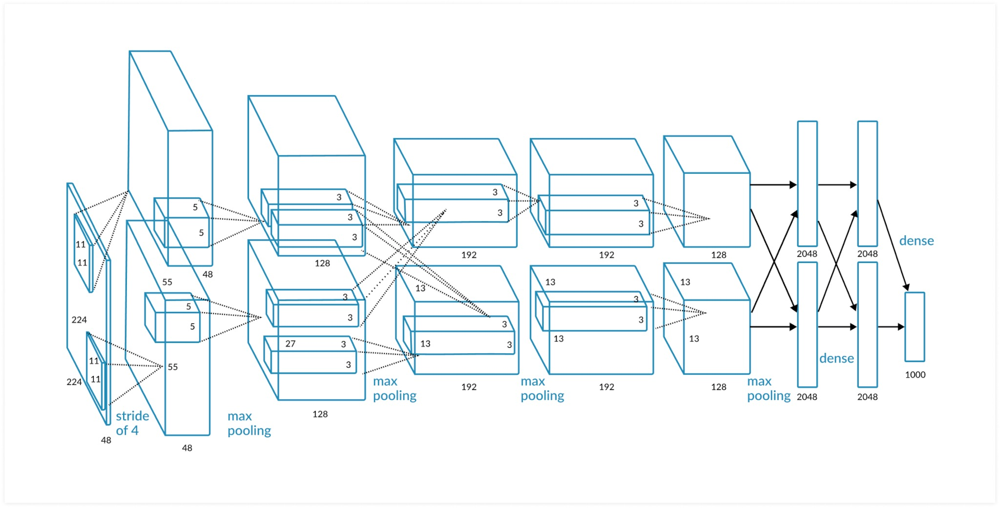
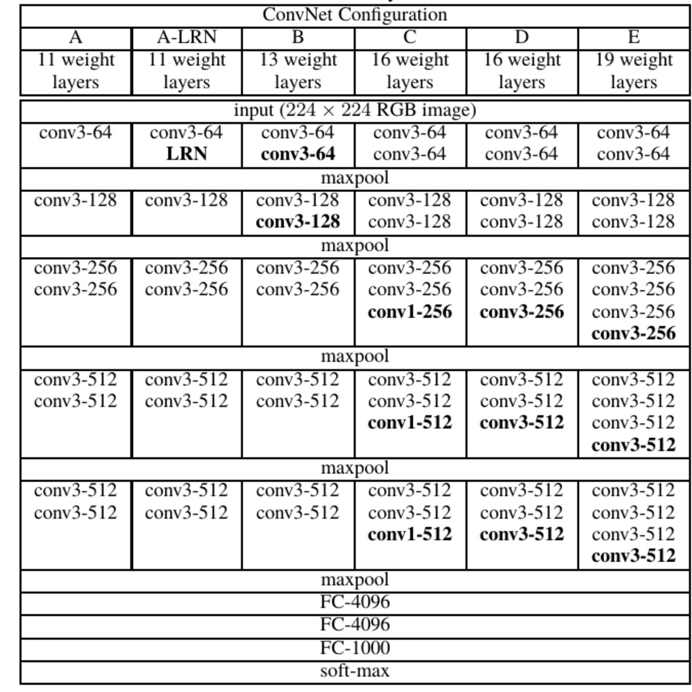

## 第一章 概述

### 1.1 简述强人工智能和弱人工智能的区别

人工智能大致分为两大类：强人工智能和弱人工智能。弱人工智能(weak artificial intelligence)是能够完成某种特定具体任务的人工智能，换个角度看，就是一种计算机科学非常平凡的应用。强人工智能(strong artificial intelligence)或通用人工智能，是具备与人类同等智慧，或超越人类的人工智能，能表现正常人类所具有的所有智能行为。*（摘录自课本 Page 1）*

### 1.2 简述人工智能研究的三个学派

人工智能按研究学派主要分为三类，包括行为主义(Behaviorism)，符号主义(Symbolism)，连接主义(Connectionism)。*（摘录自课本 Page 2）*

行为主义的核心思想是基于控制论构建感知-动作型控制系统。*（摘录自课本 Page 2）* 在C.Shannon和J.McCarthy征集出版的《自动机研究》中有很多控制论方面的研究工作，涉及有有限自动机，图灵机、合成自动机，希望基于控制论去构建一些感知动作的反应性的控制系统。从比较直观的角度来看，行为主义的方法可以模拟出类似于小脑这样的人工智能，通过反馈来实现机器人的行走、抓取、平衡，因此有很大的实用价值。但是，这类方法似乎并不是通向人工智能的终极道路。*（摘录自课本 Page 5）*

符号主义是基于符号逻辑的方法，用逻辑表示知识和求解问题。其基本思想是：用一种逻辑把各种知识都表示出来；当求解一个问题时，就将该问题转化成一个逻辑表达式，然后用已有知识的逻辑表达式的库进行推理来解决该问题。但从逻辑的角度，难以找到一种简洁的符号逻辑体系，能表述出世间所有的知识。*（摘录自课本 Page 5）* 从常识的角度，研究者还没能把一个实用领域中的所有常识都用逻辑表达式记录下来。从求解器的角度来看，解决问题的关键环节是逻辑求解器，而各种谓词逻辑一般都是不可判定的，也就是理论上不存在一种机械方法，能在有限时间内判定任意一个谓词逻辑表达式是否成立。*（摘录自课本 Page 6）*

连接主义方法的基本出发点是借鉴大脑中神经元细胞连接的计算模型，用人工神经网络来拟合智能行为。*（摘录自课本 Page 6）* 连接主义方法始于1943年，从最开始的M-P神经元模型，到感知器模型、反向传播训练方法、卷积神经网络、深度学习、深度学习和反向传播训练方法，连接主义逐渐成为整个人工智能领域的主流方向。但是我们必须清楚的认识到，深度学习不一定是通向强人工智能的终极道路。它更像是一个能帮助我们快速爬到二楼、三楼的梯子，但顺着梯子我们很难爬到月球上。深度学习已知的局限性包括：泛化能力有限、缺乏推理能力、缺乏可解释性、鲁棒性欠佳等。*（摘录自课本 Page 7 Page 8）* 

### 1.3 一个由两个输入的单个神经元构成的感知机能完成什么任务？

首先，感知器是只有输入和输出层的神经网络:

<div style="text-align:center">
  
</div>


在1958年，由美国心理学家Frank Rosenblatt提出的感知器模型中，激活函数采用的一般是符号函数，及输出

$$o = sgn(x_1w_1+x_2*w_2+b)$$

进一步表示为：

$$\begin{cases} 1, & x_1w_1+x_2 * w_2+b>=0 \\\\ -1, & x_1w_1+x_2*w_2+b<0 \end{cases}$$

如果把$o$当作因变量、$x_1、x_2$当作自变量，对于分界

$$x_1w_1+x_2w_2+b=0$$

可以抽象成三维空间里的一个分割面，能够对该面上下方的点进行分类，则**及该感知机能完成的任务是用简单的线性分类任务**，比如可以完成逻辑“与”与逻辑“或”的分类(在这里，第三维度只有1和-1两个值，分别使用实心点和空心点来表征，这样就可以在二维平面上将问题可视化)：

1. 逻辑“与”的真值表和二维样本：

   | $x_1$ | $x_2$ | $x_3$ |
   | ----- | ----- | ----- |
   | 0     | 0     | 0     |
   | 0     | 1     | 0     |
   | 1     | 0     | 0     |
   | 1     | 1     | 1     |

   <div style="text-align:center">
   	
   </div>

2. 逻辑“或”的真值表和二维样本:

   | $x_1$ | $x_2$ | $x_3$ |
   | ----- | ----- | ----- |
   | 0     | 0     | 0     |
   | 0     | 1     | 1     |
   | 1     | 0     | 1     |
   | 1     | 1     | 1     |

   <div style="text-align:center">
   	
   </div>

但是对于非线性问题，如异或问题，单层感知机就没办法实现了：

| $x_1$ | $x_2$ | $x_3$ |
| ----- | ----- | ----- |
| 0     | 0     | 0     |
| 0     | 1     | 1     |
| 1     | 0     | 1     |
| 1     | 1     | 0     |

<div style="text-align:center">
	
</div>


> 多层感知机能够实现这一点，[这篇博客](https://blog.csdn.net/york1996/article/details/98846398)指出了这样一个观点:**Kolmogorov理论指出： 双隐层感知器就足以解决任何复杂的分类问题.**~~但我没有找到相关的证明，就和8bit就足够表示Feature Map一样迷惑~~，在这篇文献：
>
> - [1].APPROXIMATION CAPABILITIES OF MULTILAYER FEEDFORWARD REGULAR FUZZY NEURAL NETWORKS[J].Applied Mathematics:A Journal of Chinese Universities,2001(01):45-57.
>
> K.Hornik证明了理论上只有一个隐层的浅层神经网络足以拟合出任意函数。但有个假设前提：一个隐层的深度可以是无限，这样就好理解了。
>
> 我找到了一篇相对清晰的证明，感兴趣的同学可以看看：https://www.cnblogs.com/yeluzi/p/7491619.html

### 1.4 深度学习的局限性有哪些？

深度学习已知的局限性包括：

**(1)泛化能力有限。** 深度学习训练需要依靠大量的样本，与人类学习的机理不同。人类在幼儿时期会依据大量外在数据学习，但是成年人类的迁移学习能力和泛化能力远高于现在的深度学习。

**(2)缺乏推理能力。** 缺乏推理能力使得深度学习不擅长解决认知类的问题。如何将擅长推理的符号逻辑与深度学习结合起来，是未来非常有潜力的发展方向。

**(3)缺乏可解释性。** 在比较重视安全的领域，缺乏可解释性会带来一些问题。比如，某个决策是如何做出来的？深度学习为什么识别错了。

**(4)鲁棒性欠佳。** 在一张图像上加一些人眼很难注意到的点，就可以让深度学习算法产生错误判断，例如把猪识别成猫，把牛识别成狗。

*（摘录自课本 Page 7 Page 8）*

### 1.5 什么是智能计算系统？

智能计算系统是智能的物质载体。*（摘录自课本  Page 8）*

### 1.6 为什么需要智能计算系统？

传统计算系统的能效难以满足应用需求。因此，人工智能不可能依赖于传统计算系统，必须有自己的核心物质载体--智能计算系统。*（摘录自课本  Page 8）*

### 1.7 第一代智能计算系统有什么特点？

第一代智能计算系统主要是在20世纪80年代人工智能发展的第二次热潮中发展起来的面向符号逻辑处理的计算系统。它们的功能主要是运行当时非常热门的智能编程语言Prolog或LISP编写的程序。*（摘录自课本  Page 9）*

### 1.8 第二代智能计算系统有什么特点？

第二代智能计算系统主要研究面向连接主义（深度学习）处理的计算机或处理器。*（摘录自课本  Page 10）*

### 1.9 第三代智能计算系统有什么特点？

编者团队认为，第三代智能计算系统将不再单纯追求智能算法的加速，它将通过近乎无限的计算能力，给人类带来前所未有的机器智能。*（摘录自课本  Page 11）*

### 1.10 假如请你设计一个智能计算系统，你打算如何设计？在你的设计里，用户将如何使用该智能计算系统？

假如让我设计一个第二代的智能计算系统，我的方案如下：

硬件层面，借助[VTA](https://tvm.apache.org/2018/07/12/vta-release-announcement)的设计思想，设计Load、Compute、Store三个模块，Load负责从DDR中缓存数据，Store负责将运算结果放回到DDR，在Compute模块里，设计一些大运算需要的加速器，例如使用脉动阵列(Systolic Array)加速矩阵乘法、快速卷机(Fast Convolution)做卷积运算等等。

软件层面:

1. 需要设计一套AI指令集，告诉加速器缓存/放回的数据地址，以及对相应数据做的Compute操作。
2. 软件上层对所需的运算，例如接受一个通用的神经网络模型，做硬件无关的优化，比如神经网络压缩，图优化，算子融合等。
3. 此外，在上层还需要做出合适的任务调度，把计算不复杂，控制性较强的部分交给CPU处理，把适合加速器运算的交给加速器运算，组成一个异构系统。
4. 软件还需要提供用户接口，可以是Python/C++等主流编程语言。

用户使用该智能计算系统时，在Python中编写相关的程序，调用配套编程框架做上层软件优化，以及对任务的调度安排，生成可以在我设计的智能计算系统上的可执行文件，用户执行该可执行文件，并给可执行文件一个输入，产生经过系统加速后的输出。

但是该系统的缺点也很明显，从底层硬件到上层软件栈，战线拉的太长了，而且硬件层面流片的成本巨大，但是深度学习所需的算子繁多并且在茁壮成长，硬件应当也需要不断的迭代更新。所以可以考虑把硬件加速的这部分换成FPGA来实现，如果需要新增算子或者更改，重新综合生成相关电路即可。

## 第二章 神经网络基础

### 2.1 多层感知机和感知机的区别是什么，为什么会有这样的区别？

感知机是只有一个神经元的单层神经网络。*（摘录自课本 Page 17）*

多层感知机是20世纪八九十年代常用的一种两层的神经网络。*（摘录自课本 Page 19）*

首先，感知机和多层感知机都可以接受若干个输入，但感知机只能有一个输出，多层感知机可以有多个输出。

此外，相比感知机而言，多层感知机可以解决输入非线性可分的问题。

### 2.2 假设有一个只有一个隐层的多层感知机，其输入、隐层、输出层的神经元个数分别为33、512、10，那么这个多层感知机中总共有多少个参数是可以被训练的？

确定weight的个数：
$$
weights = 33 * 512 +512*10= 22016
$$
确定bias的个数：
$$
biases =1+1=2
$$
这样，总共可以被训练的参数是22018个。

### 2.3 反向传播中，神经元的梯度是如何计算的？权重是如何更新的？

基于梯度下降法的神经网络反向传播过程首先需要根据应用场景定义合适损失函数（loss function），常用的损失函数有均方差损失函数和交叉熵损失函数。确定了损失函数之后，把网络的实际输出与期盼输出结合损失函数计算loss，如果loss不符合预期，则对loss分别求权重和偏置的偏导数，然后沿梯度下降方向更新权重及偏置参数。

不引入惩罚项的权重更新公式如下：
$$
w \gets	w-\eta(\triangledown_wL(w;x,y))
$$

### 2.4 请在同一个坐标系内画出五种不同的激活函数图像，并比较它们的取值范围。

仓库地址：https://github.com/LeiWang1999/AICS-Course/blob/master/Code/2.4.activationplot.py

```python
import matplotlib.pyplot as plt
import numpy as np

def sigmoid(x):
    return 1.0/(1.0+np.exp(-1.0 * x))

def tanh(x):
    return (np.exp(x)-np.exp(-1.0 * x))/(np.exp(x)+np.exp(-1.0 * x))

def ReLU(x):
    return np.maximum(0, x)

def PReLU(x, a=-0.01):
    return np.maximum(a*x, x)

def ELU(x, a=-0.01):
    y = np.zeros_like(x)
    for index, each in enumerate(x):
        y[index] = each if each>0 else a*(np.exp(each)-1.0)
    return y

x=np.linspace(-10,10,256,endpoint=True)#-π to+π的256个值
y_sigmoid = sigmoid(x)
y_tanh = tanh(x)
y_ReLU = ReLU(x)
y_PReLU = PReLU(x)
y_ELU = ELU(x)
plt.grid() # 生成网格
plt.plot(x, y_sigmoid, label='sigmoid')
plt.plot(x, y_tanh, label='tanh')
plt.plot(x, y_ReLU, label='ReLU')
plt.plot(x, y_PReLU, label='PReLU')
plt.plot(x, y_ELU, label='ELU')
plt.legend(['sigmoid','tanh', 'ReLU', 'PReLU', 'ELU'])
plt.show()
```

绘图结果如下：

<div style="text-align:center">
  
</div>


**对输入取区间[-10, 10],a取-0.01:比较取值范围：**

| Function | Minimum | Maximum |
| -------- | ------- | ------- |
| sigmoid  | 0       | 1       |
| tanh     | -1      | 1       |
| ReLU     | 0       | 10      |
| PReLU    | -0.1    | 10      |
| ELU      | 0.00038 | 10      |

### 2.5 请简述三种避免过拟合问题的方法

1. 在损失函数中增加惩罚项，常用的方法有L1正则化和L2正则化，L1正则化可以使训练出来的weight更接近于0，L2正则化可以使全中国weight的绝对值变小。
2. 稀疏化，在训练的时候将神经网络中的很多权重或神经元设置成0，也是通过增加一些惩罚项来实现的。
3. Bagging集成学习，应对一个问题时训练几个不同的网络，最后取结果的加权，减少神经网络的识别误差
4. Dropout会在训练的时候随机删除一些节点，往往会起到意想不到的结果，一般来说我们设置输入节点的采样率为0.8，隐层节点的采样率为0.5。在推理阶段，我们再将对应的节点输出乘以采样率，即训练的时候使用Dropout，但是推理的时候会使用未经裁剪的整个网络。

### 2.6 sigmoid激活函数的极限是0和1，请给出它的导数形式并求出其在原点的值

sigmoid函数如下：
$$
sigmoid(x) = \frac{1}{1+e^{-x}}
$$
求sigmoid函数的导数:
$$
\frac{\mathrm{d}sigmoid(x)}{x} = \frac{e^{-x}}{(1+e^{-x})^2}=\frac{1}{e^{-x}+e^x+2}
$$
在原点处的值为:
$$
\frac{1}{1+1+2}=0.25
$$

### 2.7 假设激活函数的表达式为$\phi(v)=\frac{v}{\sqrt{1+v^2}}$，请给出它的导数形式并求出其在原点的取值

$$
\frac{\mathrm{d}\phi(v)}{\mathrm{d}v}=\frac{\mathrm{d}v*(1+v^2)^{-1/2}}{\mathrm{d}v}=\frac{\mathrm{d}(1+v^2)(1+v^2)^{-3/2}+\mathrm{d}-v^2(1+v^2)^{-3/2}}{\mathrm{d}v}=\frac{1}{(1+v^2)^{3/2}}
$$

当在原点处时，该激活函数的导数取值为1。

### 2.8 假设基本采用表2.1中的符号，一个经过训练的有两个隐层的MLP如何决定各个输出神经元的标签？预测过程中，当前输入的样本的标签如何决定？

题目没有给出，两个隐藏层的神经元个数是多少个，我们可以假设输入矩阵为**x**，输入层和第一层隐层的权重为**w1**，第一层隐层和第二层隐层的权重为**w2**.输出为**y**，则有:
$$
temp=w_1^T*x \\\\
y = w_2^T*temp
$$
输出样本的标签由输出**y**的最大值的下标决定。

### 2.9 一种更新权重的方法是引入动量项，公式如下，动量a的取值范围通常为[0, 1]，这样对于权重更新有什么影响？如果取值范围是[-1,0]呢？

$$
\triangle w(n) = a\triangle w(n-1)+a^2\triangle w(n-2)+...
$$

当a为[0,1]时，动量项表现为惩罚项，每一次求梯度的时候都会考虑到之前几步更新权重的的动量，并且距离越近影响越大，梯度更新的曲线会越平滑，并且因为考虑到动量，就有可能突破local minimal，找到global minimal。具体的知识可以以`momentum`为keyword搜索相关资料。

当a为[-1,0]时，动量项表现为奖励项，这样梯度的收敛曲线应该会更陡峭，至于有啥用途想不到。

### 2.10 反向传播中，采用不同的激活函数对于梯度的计算有什么不同？请设计一个新的激活函数并给出神经元的梯度计算公式。

梯度的计算需要求目标函数关于权重和偏置的偏导数，激活函数不同会导致偏导数不同，进而影响梯度的计算。

设计一个新的激活函数：
$$
\delta(z) = e^z
$$
对一个简单的神经元：

<div style="text-align:center">
  
</div>
则有
$$
y = \delta(w*x+b)=e^{w*x+b}
$$
选择目标函数为均方误差（mean-square error, MSE）：
$$
Loss=(\check y - y)^2 = (\check y - e^{w*x+b})^2
$$
神经元的梯度计算公式:
$$
\triangledown_w=\frac{\partial Loss}{\partial w}=-2xe^{wx+b}(\check y - e^{wx+b}) \\\\
\triangledown_b=\frac{\partial Loss}{\partial b}=2e^{wx+b}(\check y - e^{wx+b})
$$

### 2.11 请设计一个多层感知机实现4位全加器的功能，即两个4比特输入得到一个4比特输出以及1比特进位。请自行构建训练集、测试集，完成训练及测试。

Github Code Link：https://github.com/LeiWang1999/AICS-Course/tree/master/Code/2.11.fulladder.pytorch

框架：Pytorch

网络结构：简单的MLP、两个隐层layer、各20个node、激活函数使用的是Relu。

```python
class MLP(nn.Module):
    def __init__(self, input_dim, hidden_1, hidden_2, output_dim):
        super(MLP,self).__init__()
        self.layer1 = nn.Sequential(nn.Linear(input_dim, hidden_1), nn.ReLU(True))
        self.layer2 = nn.Sequential(nn.Linear(hidden_1, hidden_2), nn.ReLU(True))
        self.layer3 = nn.Sequential(nn.Linear(hidden_2, output_dim))

    def forward(self,x):
        x = self.layer1(x)
        x = self.layer2(x)
        x = self.layer3(x)
        return x
```

**数据集构建**：

1. 使用python实现二进制全加器(`binary_adder.py`)、然后遍历输出构建数据集
2. 对数据集做了shuffle，再分出训练集和测试集、这样提取的特征更准确

200个epoch可以达到100%的准确率：

```zsh
[epoch 194] train_loss: 0.920  test_accuracy: 1.000
train loss: 100%[*************************************************->]0.0021
 time.perf_counter()-t1
[epoch 195] train_loss: 0.929  test_accuracy: 1.000
train loss: 100%[*************************************************->]0.0021
 time.perf_counter()-t1
[epoch 196] train_loss: 0.979  test_accuracy: 1.000
train loss: 100%[*************************************************->]0.0021
 time.perf_counter()-t1
[epoch 197] train_loss: 1.004  test_accuracy: 1.000
train loss: 100%[*************************************************->]0.0020
 time.perf_counter()-t1
[epoch 198] train_loss: 0.995  test_accuracy: 1.000
train loss: 100%[*************************************************->]0.0020
 time.perf_counter()-t1
[epoch 199] train_loss: 0.927  test_accuracy: 1.000
train loss: 100%[*************************************************->]0.0010
 time.perf_counter()-t1
[epoch 200] train_loss: 0.979  test_accuracy: 1.000
Finished Training
```

### 2.12 在不使用编程框架的前提下，重新实现解决习题2.11的代码。

Github Code Link:https://github.com/LeiWang1999/AICS-Course/tree/master/Code/2.12.fulladder.cpp

```C++
int main(){
    // generate test data
    vector<vector<bool>> batch_input;
    vector<vector<bool>> batch_output;
    vector<vector<bool>> train_input;
    vector<vector<bool>> train_output;
    vector<vector<bool>> test_input;
    vector<vector<bool>> test_output;
    data_gen(batch_input, batch_output, true);
    data_split(batch_input, batch_output,
            train_input,train_output,
            test_input, test_output,
            0.7
            );
    // init MLP
    int num_layers = 4;
    int num_Neurons[] = {9, 20, 20, 5};
    int epochs = 200;
    MLP mlp(num_layers, num_Neurons);
    for(int epoch = 1; epoch <= epochs; epoch++){
        cout << "Current Epoch : " << epoch << " Batch Size : " << train_input.size() ;
        for (int i = 0; i < train_input.size(); ++i) {
            double* output = NULL;
            double target[num_Neurons[num_layers - 1]] ;
            mlp.input(train_input[i]);
            mlp.forward();
            output = mlp.get_output();
            for (int j = 0; j < num_Neurons[num_layers-1]; ++j) {
                target[j] = train_output[i][j];
            }
            mlp.backward(output, target);
        }
        int acc = 0;
        cout << " training loss : " << mlp.get_loss() << " outputBatchSize : " << test_input.size();
        for (int i = 0; i < test_input.size(); ++i) {
            double* output = NULL;
            mlp.input(test_input[i]);
            mlp.forward();
            output = mlp.get_output();
            // loop neurons
            int j;
            for (j = 0; j < num_Neurons[num_layers-1]; ++j) {
                if ((output[j]<0.5 && test_output[i][j] == 0) || (output[j] >= 0.5 && test_output[i][j] == 1))
                    continue;
                else
                    break;
            }
            if(j == num_Neurons[num_layers-1]){
                acc++;
            }
        }
        cout << " acc : " << 1.0 * acc / test_input.size() << endl;
    }
//    data_gen_test();
//    mlp_test();

    return 0;
}
```

和Pytorch的网络结构基本相同，不同的是激活函数使用的是Sigmoid、而Pytorch里使用的是Relu。

运行结果：

```zsh
Current Epoch : 938 Batch Size : 358 training loss : 2.74758e-07 outputBatchSize : 154 acc : 0.616883
Current Epoch : 939 Batch Size : 358 training loss : 3.31897e-07 outputBatchSize : 154 acc : 0.668831
Current Epoch : 940 Batch Size : 358 training loss : 4.30856e-07 outputBatchSize : 154 acc : 0.688312
Current Epoch : 941 Batch Size : 358 training loss : 6.82454e-08 outputBatchSize : 154 acc : 0.668831
Current Epoch : 942 Batch Size : 358 training loss : 2.97463e-07 outputBatchSize : 154 acc : 0.714286
Current Epoch : 943 Batch Size : 358 training loss : 1.849e-07 outputBatchSize : 154 acc : 0.714286
Current Epoch : 944 Batch Size : 358 training loss : 1.77274e-07 outputBatchSize : 154 acc : 0.707792
Current Epoch : 945 Batch Size : 358 training loss : 3.79138e-07 outputBatchSize : 154 acc : 0.707792
Current Epoch : 946 Batch Size : 358 training loss : 7.08133e-08 outputBatchSize : 154 acc : 0.701299
```

## 第三章 深度学习

### 3.1 计算AlexNet、VGG19、ResNet152三个网络中的神经元数目及可训练的参数数目。

#### 3.1.1 AlexNet



AlexNet的论文里为了方便使用两块GPU一起训练，网络分了两路，合并成一路网络来看，共有五层卷积层，三层全联接层，但是在分析神经元个数及可训练参数的时候需要注意，使用两块GPU进行训练的网络，有部分卷积和前一级的两个特征图相连，而有部分卷积只和前一级的单块GPU上的特征图相连，具体的链接关系可以参考上图。

这里首先需要明确一下神经元的定义，题目中要计算的神经元的个数，**那对于卷积运算神经元的数目应该如何计算？**

一个神经元表示的是w*x+b​的过程，而对于卷积运算来说，`feature map`取代了全连接层的layer、所以`feature map`的大小就是神经元的个数。但是对于特征图经过池化层之后得到的下一次卷积的输入，及池化后的结果不把其计算到神经元数目之中，其运算的本质是比大小，不明显符合神经元的特征。

| Convolution Layer | Kernel Size | Channel Number | Output Size |
| ----------------- | ----------- | -------------- | ----------- |
| conv_1            | 11*11       | 96             | (27,27,96)  |
| conv_2            | 5*5         | 256            | (13,13,256) |
| conv_3            | 3*3         | 384            | (13,13,384) |
| conv_4            | 3*3         | 384            | (13,13,384) |
| conv_5            | 3*3         | 256            | (6,6,256)   |

因为部分卷积层之后涉及到池化，所以不单独在表格后面列出神经元的数目的计算程式。

第一层是输入层、神经元的数目：
$$
227*227*3 = 154587
$$
无可训练参数。

对第一层卷积，因为Output Size的大小实际上是经过Max Pooling过的，所以神经元数目：
$$
55*55*96=290400
$$
可训练参数：
$$
weights+bias = 96*11*11*3+96 = 34944
$$
对第二层卷积，依然有Max Pooling神经元数目：
$$
27*27*256=186624
$$
可训练参数：
$$
weights+bias = 2*(128*48*5*5+128)=307456
$$

对于第三层卷积，没有Max Pooling神经元数目：
$$
13*13*384 = 64896
$$
可训练参数，这里是与前面的两个特征图都连接的：
$$
weights+bias = 384*3*3*256+384=885120
$$
对于第四层卷积，神经元数目：

$$
13*13*384=64896
$$
可训练参数:
$$
weights+bias = 2*(192*3*3*192+192)=663936
$$
对于第五层卷积，神经元数目：
$$
13*13*256 = 43264
$$
可训练参数:
$$
weights+bias=2*(128*192*3*3+128)=442624
$$

| Fully-Connect Layer | Nodes | 神经元数目 | 可训练参数                   |
| ------------------- | ----- | ---------- | ---------------------------- |
| FC1                 | 4096  | 4096       | $4096*6*6*256+4096=37752832$ |
| FC2                 | 4096  | 4096       | $4096*4096+4096=16781312$    |
| FC3                 | 1000  | 1000       | $4096*1000+1000=4087000$     |

总神经元数目：
$$
154587+290400+186624+64896+64896+43264+4096+4096+1000=813859
$$
可训练参数
$$
34944+307456+885120+663936+442624+37752832+16781312+4087000=60955224
$$
有关于卷积运算和全联接层的神经元参数计算和可训练参数的计算方法已经在[3.1.1](#3.1.1 AlexNet)里说的很详细了，对于接下来要分析的VGG19、以及多达一百多层的ResNet158，把一层一层的神经元个数与可训练参数都罗列出来显然是不合适的，我使用Pytorch来分析可训练参数以参数数目。

借鉴了方案来自：https://github.com/TylerYep/torchinfo

程式代码：https://github.com/LeiWang1999/AICS-Course/tree/master/Code/3.1.netcalculation.pytorch

```zsh
==========================================================================================
Layer (type:depth-idx)                   Output Shape              Param #
==========================================================================================
├─Sequential: 1-1                        [1, 256, 6, 6]            --
|    └─Conv2d: 2-1                       [1, 64, 55, 55]           23,296
|    └─ReLU: 2-2                         [1, 64, 55, 55]           --
|    └─MaxPool2d: 2-3                    [1, 64, 27, 27]           --
|    └─Conv2d: 2-4                       [1, 192, 27, 27]          307,392
|    └─ReLU: 2-5                         [1, 192, 27, 27]          --
|    └─MaxPool2d: 2-6                    [1, 192, 13, 13]          --
|    └─Conv2d: 2-7                       [1, 384, 13, 13]          663,936
|    └─ReLU: 2-8                         [1, 384, 13, 13]          --
|    └─Conv2d: 2-9                       [1, 256, 13, 13]          884,992
|    └─ReLU: 2-10                        [1, 256, 13, 13]          --
|    └─Conv2d: 2-11                      [1, 256, 13, 13]          590,080
|    └─ReLU: 2-12                        [1, 256, 13, 13]          --
|    └─MaxPool2d: 2-13                   [1, 256, 6, 6]            --
├─AdaptiveAvgPool2d: 1-2                 [1, 256, 6, 6]            --
├─Sequential: 1-3                        [1, 1000]                 --
|    └─Dropout: 2-14                     [1, 9216]                 --
|    └─Linear: 2-15                      [1, 4096]                 37,752,832
|    └─ReLU: 2-16                        [1, 4096]                 --
|    └─Dropout: 2-17                     [1, 4096]                 --
|    └─Linear: 2-18                      [1, 4096]                 16,781,312
|    └─ReLU: 2-19                        [1, 4096]                 --
|    └─Linear: 2-20                      [1, 1000]                 4,097,000
==========================================================================================
Total params: 61,100,840
Trainable params: 61,100,840
Non-trainable params: 0
Total mult-adds (M): 775.28
==========================================================================================
Input size (MB): 0.57
Forward/backward pass size (MB): 3.77
Params size (MB): 233.08
Estimated Total Size (MB): 237.43
==========================================================================================
```

#### 3.1.2 VGG19



```zsh
==========================================================================================
Layer (type:depth-idx)                   Output Shape              Param #
==========================================================================================
├─Sequential: 1-1                        [1, 512, 7, 7]            --
|    └─Conv2d: 2-1                       [1, 64, 224, 224]         1,792
|    └─ReLU: 2-2                         [1, 64, 224, 224]         --
|    └─Conv2d: 2-3                       [1, 64, 224, 224]         36,928
|    └─ReLU: 2-4                         [1, 64, 224, 224]         --
|    └─MaxPool2d: 2-5                    [1, 64, 112, 112]         --
|    └─Conv2d: 2-6                       [1, 128, 112, 112]        73,856
|    └─ReLU: 2-7                         [1, 128, 112, 112]        --
|    └─Conv2d: 2-8                       [1, 128, 112, 112]        147,584
|    └─ReLU: 2-9                         [1, 128, 112, 112]        --
|    └─MaxPool2d: 2-10                   [1, 128, 56, 56]          --
|    └─Conv2d: 2-11                      [1, 256, 56, 56]          295,168
|    └─ReLU: 2-12                        [1, 256, 56, 56]          --
|    └─Conv2d: 2-13                      [1, 256, 56, 56]          590,080
|    └─ReLU: 2-14                        [1, 256, 56, 56]          --
|    └─Conv2d: 2-15                      [1, 256, 56, 56]          590,080
|    └─ReLU: 2-16                        [1, 256, 56, 56]          --
|    └─Conv2d: 2-17                      [1, 256, 56, 56]          590,080
|    └─ReLU: 2-18                        [1, 256, 56, 56]          --
|    └─MaxPool2d: 2-19                   [1, 256, 28, 28]          --
|    └─Conv2d: 2-20                      [1, 512, 28, 28]          1,180,160
|    └─ReLU: 2-21                        [1, 512, 28, 28]          --
|    └─Conv2d: 2-22                      [1, 512, 28, 28]          2,359,808
|    └─ReLU: 2-23                        [1, 512, 28, 28]          --
|    └─Conv2d: 2-24                      [1, 512, 28, 28]          2,359,808
|    └─ReLU: 2-25                        [1, 512, 28, 28]          --
|    └─Conv2d: 2-26                      [1, 512, 28, 28]          2,359,808
|    └─ReLU: 2-27                        [1, 512, 28, 28]          --
|    └─MaxPool2d: 2-28                   [1, 512, 14, 14]          --
|    └─Conv2d: 2-29                      [1, 512, 14, 14]          2,359,808
|    └─ReLU: 2-30                        [1, 512, 14, 14]          --
|    └─Conv2d: 2-31                      [1, 512, 14, 14]          2,359,808
|    └─ReLU: 2-32                        [1, 512, 14, 14]          --
|    └─Conv2d: 2-33                      [1, 512, 14, 14]          2,359,808
|    └─ReLU: 2-34                        [1, 512, 14, 14]          --
|    └─Conv2d: 2-35                      [1, 512, 14, 14]          2,359,808
|    └─ReLU: 2-36                        [1, 512, 14, 14]          --
|    └─MaxPool2d: 2-37                   [1, 512, 7, 7]            --
├─AdaptiveAvgPool2d: 1-2                 [1, 512, 7, 7]            --
├─Sequential: 1-3                        [1, 1000]                 --
|    └─Linear: 2-38                      [1, 4096]                 102,764,544
|    └─ReLU: 2-39                        [1, 4096]                 --
|    └─Dropout: 2-40                     [1, 4096]                 --
|    └─Linear: 2-41                      [1, 4096]                 16,781,312
|    └─ReLU: 2-42                        [1, 4096]                 --
|    └─Dropout: 2-43                     [1, 4096]                 --
|    └─Linear: 2-44                      [1, 1000]                 4,097,000
==========================================================================================
Total params: 143,667,240
Trainable params: 143,667,240
Non-trainable params: 0
Total mult-adds (G): 19.78
==========================================================================================
Input size (MB): 0.57
Forward/backward pass size (MB): 113.38
Params size (MB): 548.05
Estimated Total Size (MB): 662.00
==========================================================================================
```

#### 3.1.3 ResNet152

```zsh
Estimated Total Size (MB): 662.00
==========================================================================================
==========================================================================================
Layer (type:depth-idx)                   Output Shape              Param #
==========================================================================================
├─Conv2d: 1-1                            [1, 64, 112, 112]         9,408
├─BatchNorm2d: 1-2                       [1, 64, 112, 112]         128
├─ReLU: 1-3                              [1, 64, 112, 112]         --
├─MaxPool2d: 1-4                         [1, 64, 56, 56]           --
├─Sequential: 1-5                        [1, 256, 56, 56]          --
|    └─Bottleneck: 2-1                   [1, 256, 56, 56]          --
|    |    └─Conv2d: 3-1                  [1, 64, 56, 56]           4,096
|    |    └─BatchNorm2d: 3-2             [1, 64, 56, 56]           128
|    |    └─ReLU: 3-3                    [1, 64, 56, 56]           --
|    |    └─Conv2d: 3-4                  [1, 64, 56, 56]           36,864
|    |    └─BatchNorm2d: 3-5             [1, 64, 56, 56]           128
|    |    └─ReLU: 3-6                    [1, 64, 56, 56]           --
|    |    └─Conv2d: 3-7                  [1, 256, 56, 56]          16,384
|    |    └─BatchNorm2d: 3-8             [1, 256, 56, 56]          512
|    |    └─Sequential: 3-9              [1, 256, 56, 56]          16,896
|    |    └─ReLU: 3-10                   [1, 256, 56, 56]          --
|    └─Bottleneck: 2-2                   [1, 256, 56, 56]          --
|    |    └─Conv2d: 3-11                 [1, 64, 56, 56]           16,384
|    |    └─BatchNorm2d: 3-12            [1, 64, 56, 56]           128
|    |    └─ReLU: 3-13                   [1, 64, 56, 56]           --
|    |    └─Conv2d: 3-14                 [1, 64, 56, 56]           36,864
|    |    └─BatchNorm2d: 3-15            [1, 64, 56, 56]           128
|    |    └─ReLU: 3-16                   [1, 64, 56, 56]           --
|    |    └─Conv2d: 3-17                 [1, 256, 56, 56]          16,384
|    |    └─BatchNorm2d: 3-18            [1, 256, 56, 56]          512
|    |    └─ReLU: 3-19                   [1, 256, 56, 56]          --
|    └─Bottleneck: 2-3                   [1, 256, 56, 56]          --
|    |    └─Conv2d: 3-20                 [1, 64, 56, 56]           16,384
|    |    └─BatchNorm2d: 3-21            [1, 64, 56, 56]           128
|    |    └─ReLU: 3-22                   [1, 64, 56, 56]           --
|    |    └─Conv2d: 3-23                 [1, 64, 56, 56]           36,864
|    |    └─BatchNorm2d: 3-24            [1, 64, 56, 56]           128
|    |    └─ReLU: 3-25                   [1, 64, 56, 56]           --
|    |    └─Conv2d: 3-26                 [1, 256, 56, 56]          16,384
|    |    └─BatchNorm2d: 3-27            [1, 256, 56, 56]          512
|    |    └─ReLU: 3-28                   [1, 256, 56, 56]          --
├─Sequential: 1-6                        [1, 512, 28, 28]          --
|    └─Bottleneck: 2-4                   [1, 512, 28, 28]          --
|    |    └─Conv2d: 3-29                 [1, 128, 56, 56]          32,768
|    |    └─BatchNorm2d: 3-30            [1, 128, 56, 56]          256
|    |    └─ReLU: 3-31                   [1, 128, 56, 56]          --
|    |    └─Conv2d: 3-32                 [1, 128, 28, 28]          147,456
|    |    └─BatchNorm2d: 3-33            [1, 128, 28, 28]          256
|    |    └─ReLU: 3-34                   [1, 128, 28, 28]          --
|    |    └─Conv2d: 3-35                 [1, 512, 28, 28]          65,536
|    |    └─BatchNorm2d: 3-36            [1, 512, 28, 28]          1,024
|    |    └─Sequential: 3-37             [1, 512, 28, 28]          132,096
|    |    └─ReLU: 3-38                   [1, 512, 28, 28]          --
|    └─Bottleneck: 2-5                   [1, 512, 28, 28]          --
|    |    └─Conv2d: 3-39                 [1, 128, 28, 28]          65,536
|    |    └─BatchNorm2d: 3-40            [1, 128, 28, 28]          256
|    |    └─ReLU: 3-41                   [1, 128, 28, 28]          --
|    |    └─Conv2d: 3-42                 [1, 128, 28, 28]          147,456
|    |    └─BatchNorm2d: 3-43            [1, 128, 28, 28]          256
|    |    └─ReLU: 3-44                   [1, 128, 28, 28]          --
|    |    └─Conv2d: 3-45                 [1, 512, 28, 28]          65,536
|    |    └─BatchNorm2d: 3-46            [1, 512, 28, 28]          1,024
|    |    └─ReLU: 3-47                   [1, 512, 28, 28]          --
|    └─Bottleneck: 2-6                   [1, 512, 28, 28]          --
|    |    └─Conv2d: 3-48                 [1, 128, 28, 28]          65,536
|    |    └─BatchNorm2d: 3-49            [1, 128, 28, 28]          256
|    |    └─ReLU: 3-50                   [1, 128, 28, 28]          --
|    |    └─Conv2d: 3-51                 [1, 128, 28, 28]          147,456
|    |    └─BatchNorm2d: 3-52            [1, 128, 28, 28]          256
|    |    └─ReLU: 3-53                   [1, 128, 28, 28]          --
|    |    └─Conv2d: 3-54                 [1, 512, 28, 28]          65,536
|    |    └─BatchNorm2d: 3-55            [1, 512, 28, 28]          1,024
|    |    └─ReLU: 3-56                   [1, 512, 28, 28]          --
|    └─Bottleneck: 2-7                   [1, 512, 28, 28]          --
|    |    └─Conv2d: 3-57                 [1, 128, 28, 28]          65,536
|    |    └─BatchNorm2d: 3-58            [1, 128, 28, 28]          256
|    |    └─ReLU: 3-59                   [1, 128, 28, 28]          --
|    |    └─Conv2d: 3-60                 [1, 128, 28, 28]          147,456
|    |    └─BatchNorm2d: 3-61            [1, 128, 28, 28]          256
|    |    └─ReLU: 3-62                   [1, 128, 28, 28]          --
|    |    └─Conv2d: 3-63                 [1, 512, 28, 28]          65,536
|    |    └─BatchNorm2d: 3-64            [1, 512, 28, 28]          1,024
|    |    └─ReLU: 3-65                   [1, 512, 28, 28]          --
|    └─Bottleneck: 2-8                   [1, 512, 28, 28]          --
|    |    └─Conv2d: 3-66                 [1, 128, 28, 28]          65,536
|    |    └─BatchNorm2d: 3-67            [1, 128, 28, 28]          256
|    |    └─ReLU: 3-68                   [1, 128, 28, 28]          --
|    |    └─Conv2d: 3-69                 [1, 128, 28, 28]          147,456
|    |    └─BatchNorm2d: 3-70            [1, 128, 28, 28]          256
|    |    └─ReLU: 3-71                   [1, 128, 28, 28]          --
|    |    └─Conv2d: 3-72                 [1, 512, 28, 28]          65,536
|    |    └─BatchNorm2d: 3-73            [1, 512, 28, 28]          1,024
|    |    └─ReLU: 3-74                   [1, 512, 28, 28]          --
|    └─Bottleneck: 2-9                   [1, 512, 28, 28]          --
|    |    └─Conv2d: 3-75                 [1, 128, 28, 28]          65,536
|    |    └─BatchNorm2d: 3-76            [1, 128, 28, 28]          256
|    |    └─ReLU: 3-77                   [1, 128, 28, 28]          --
|    |    └─Conv2d: 3-78                 [1, 128, 28, 28]          147,456
|    |    └─BatchNorm2d: 3-79            [1, 128, 28, 28]          256
|    |    └─ReLU: 3-80                   [1, 128, 28, 28]          --
|    |    └─Conv2d: 3-81                 [1, 512, 28, 28]          65,536
|    |    └─BatchNorm2d: 3-82            [1, 512, 28, 28]          1,024
|    |    └─ReLU: 3-83                   [1, 512, 28, 28]          --
|    └─Bottleneck: 2-10                  [1, 512, 28, 28]          --
|    |    └─Conv2d: 3-84                 [1, 128, 28, 28]          65,536
|    |    └─BatchNorm2d: 3-85            [1, 128, 28, 28]          256
|    |    └─ReLU: 3-86                   [1, 128, 28, 28]          --
|    |    └─Conv2d: 3-87                 [1, 128, 28, 28]          147,456
|    |    └─BatchNorm2d: 3-88            [1, 128, 28, 28]          256
|    |    └─ReLU: 3-89                   [1, 128, 28, 28]          --
|    |    └─Conv2d: 3-90                 [1, 512, 28, 28]          65,536
|    |    └─BatchNorm2d: 3-91            [1, 512, 28, 28]          1,024
|    |    └─ReLU: 3-92                   [1, 512, 28, 28]          --
|    └─Bottleneck: 2-11                  [1, 512, 28, 28]          --
|    |    └─Conv2d: 3-93                 [1, 128, 28, 28]          65,536
|    |    └─BatchNorm2d: 3-94            [1, 128, 28, 28]          256
|    |    └─ReLU: 3-95                   [1, 128, 28, 28]          --
|    |    └─Conv2d: 3-96                 [1, 128, 28, 28]          147,456
|    |    └─BatchNorm2d: 3-97            [1, 128, 28, 28]          256
|    |    └─ReLU: 3-98                   [1, 128, 28, 28]          --
|    |    └─Conv2d: 3-99                 [1, 512, 28, 28]          65,536
|    |    └─BatchNorm2d: 3-100           [1, 512, 28, 28]          1,024
|    |    └─ReLU: 3-101                  [1, 512, 28, 28]          --
├─Sequential: 1-7                        [1, 1024, 14, 14]         --
|    └─Bottleneck: 2-12                  [1, 1024, 14, 14]         --
|    |    └─Conv2d: 3-102                [1, 256, 28, 28]          131,072
|    |    └─BatchNorm2d: 3-103           [1, 256, 28, 28]          512
|    |    └─ReLU: 3-104                  [1, 256, 28, 28]          --
|    |    └─Conv2d: 3-105                [1, 256, 14, 14]          589,824
|    |    └─BatchNorm2d: 3-106           [1, 256, 14, 14]          512
|    |    └─ReLU: 3-107                  [1, 256, 14, 14]          --
|    |    └─Conv2d: 3-108                [1, 1024, 14, 14]         262,144
|    |    └─BatchNorm2d: 3-109           [1, 1024, 14, 14]         2,048
|    |    └─Sequential: 3-110            [1, 1024, 14, 14]         526,336
|    |    └─ReLU: 3-111                  [1, 1024, 14, 14]         --
|    └─Bottleneck: 2-13                  [1, 1024, 14, 14]         --
|    |    └─Conv2d: 3-112                [1, 256, 14, 14]          262,144
|    |    └─BatchNorm2d: 3-113           [1, 256, 14, 14]          512
|    |    └─ReLU: 3-114                  [1, 256, 14, 14]          --
|    |    └─Conv2d: 3-115                [1, 256, 14, 14]          589,824
|    |    └─BatchNorm2d: 3-116           [1, 256, 14, 14]          512
|    |    └─ReLU: 3-117                  [1, 256, 14, 14]          --
|    |    └─Conv2d: 3-118                [1, 1024, 14, 14]         262,144
|    |    └─BatchNorm2d: 3-119           [1, 1024, 14, 14]         2,048
|    |    └─ReLU: 3-120                  [1, 1024, 14, 14]         --
|    └─Bottleneck: 2-14                  [1, 1024, 14, 14]         --
|    |    └─Conv2d: 3-121                [1, 256, 14, 14]          262,144
|    |    └─BatchNorm2d: 3-122           [1, 256, 14, 14]          512
|    |    └─ReLU: 3-123                  [1, 256, 14, 14]          --
|    |    └─Conv2d: 3-124                [1, 256, 14, 14]          589,824
|    |    └─BatchNorm2d: 3-125           [1, 256, 14, 14]          512
|    |    └─ReLU: 3-126                  [1, 256, 14, 14]          --
|    |    └─Conv2d: 3-127                [1, 1024, 14, 14]         262,144
|    |    └─BatchNorm2d: 3-128           [1, 1024, 14, 14]         2,048
|    |    └─ReLU: 3-129                  [1, 1024, 14, 14]         --
|    └─Bottleneck: 2-15                  [1, 1024, 14, 14]         --
|    |    └─Conv2d: 3-130                [1, 256, 14, 14]          262,144
|    |    └─BatchNorm2d: 3-131           [1, 256, 14, 14]          512
|    |    └─ReLU: 3-132                  [1, 256, 14, 14]          --
|    |    └─Conv2d: 3-133                [1, 256, 14, 14]          589,824
|    |    └─BatchNorm2d: 3-134           [1, 256, 14, 14]          512
|    |    └─ReLU: 3-135                  [1, 256, 14, 14]          --
|    |    └─Conv2d: 3-136                [1, 1024, 14, 14]         262,144
|    |    └─BatchNorm2d: 3-137           [1, 1024, 14, 14]         2,048
|    |    └─ReLU: 3-138                  [1, 1024, 14, 14]         --
|    └─Bottleneck: 2-16                  [1, 1024, 14, 14]         --
|    |    └─Conv2d: 3-139                [1, 256, 14, 14]          262,144
|    |    └─BatchNorm2d: 3-140           [1, 256, 14, 14]          512
|    |    └─ReLU: 3-141                  [1, 256, 14, 14]          --
|    |    └─Conv2d: 3-142                [1, 256, 14, 14]          589,824
|    |    └─BatchNorm2d: 3-143           [1, 256, 14, 14]          512
|    |    └─ReLU: 3-144                  [1, 256, 14, 14]          --
|    |    └─Conv2d: 3-145                [1, 1024, 14, 14]         262,144
|    |    └─BatchNorm2d: 3-146           [1, 1024, 14, 14]         2,048
|    |    └─ReLU: 3-147                  [1, 1024, 14, 14]         --
|    └─Bottleneck: 2-17                  [1, 1024, 14, 14]         --
|    |    └─Conv2d: 3-148                [1, 256, 14, 14]          262,144
|    |    └─BatchNorm2d: 3-149           [1, 256, 14, 14]          512
|    |    └─ReLU: 3-150                  [1, 256, 14, 14]          --
|    |    └─Conv2d: 3-151                [1, 256, 14, 14]          589,824
|    |    └─BatchNorm2d: 3-152           [1, 256, 14, 14]          512
|    |    └─ReLU: 3-153                  [1, 256, 14, 14]          --
|    |    └─Conv2d: 3-154                [1, 1024, 14, 14]         262,144
|    |    └─BatchNorm2d: 3-155           [1, 1024, 14, 14]         2,048
|    |    └─ReLU: 3-156                  [1, 1024, 14, 14]         --
|    └─Bottleneck: 2-18                  [1, 1024, 14, 14]         --
|    |    └─Conv2d: 3-157                [1, 256, 14, 14]          262,144
|    |    └─BatchNorm2d: 3-158           [1, 256, 14, 14]          512
|    |    └─ReLU: 3-159                  [1, 256, 14, 14]          --
|    |    └─Conv2d: 3-160                [1, 256, 14, 14]          589,824
|    |    └─BatchNorm2d: 3-161           [1, 256, 14, 14]          512
|    |    └─ReLU: 3-162                  [1, 256, 14, 14]          --
|    |    └─Conv2d: 3-163                [1, 1024, 14, 14]         262,144
|    |    └─BatchNorm2d: 3-164           [1, 1024, 14, 14]         2,048
|    |    └─ReLU: 3-165                  [1, 1024, 14, 14]         --
|    └─Bottleneck: 2-19                  [1, 1024, 14, 14]         --
|    |    └─Conv2d: 3-166                [1, 256, 14, 14]          262,144
|    |    └─BatchNorm2d: 3-167           [1, 256, 14, 14]          512
|    |    └─ReLU: 3-168                  [1, 256, 14, 14]          --
|    |    └─Conv2d: 3-169                [1, 256, 14, 14]          589,824
|    |    └─BatchNorm2d: 3-170           [1, 256, 14, 14]          512
|    |    └─ReLU: 3-171                  [1, 256, 14, 14]          --
|    |    └─Conv2d: 3-172                [1, 1024, 14, 14]         262,144
|    |    └─BatchNorm2d: 3-173           [1, 1024, 14, 14]         2,048
|    |    └─ReLU: 3-174                  [1, 1024, 14, 14]         --
|    └─Bottleneck: 2-20                  [1, 1024, 14, 14]         --
|    |    └─Conv2d: 3-175                [1, 256, 14, 14]          262,144
|    |    └─BatchNorm2d: 3-176           [1, 256, 14, 14]          512
|    |    └─ReLU: 3-177                  [1, 256, 14, 14]          --
|    |    └─Conv2d: 3-178                [1, 256, 14, 14]          589,824
|    |    └─BatchNorm2d: 3-179           [1, 256, 14, 14]          512
|    |    └─ReLU: 3-180                  [1, 256, 14, 14]          --
|    |    └─Conv2d: 3-181                [1, 1024, 14, 14]         262,144
|    |    └─BatchNorm2d: 3-182           [1, 1024, 14, 14]         2,048
|    |    └─ReLU: 3-183                  [1, 1024, 14, 14]         --
|    └─Bottleneck: 2-21                  [1, 1024, 14, 14]         --
|    |    └─Conv2d: 3-184                [1, 256, 14, 14]          262,144
|    |    └─BatchNorm2d: 3-185           [1, 256, 14, 14]          512
|    |    └─ReLU: 3-186                  [1, 256, 14, 14]          --
|    |    └─Conv2d: 3-187                [1, 256, 14, 14]          589,824
|    |    └─BatchNorm2d: 3-188           [1, 256, 14, 14]          512
|    |    └─ReLU: 3-189                  [1, 256, 14, 14]          --
|    |    └─Conv2d: 3-190                [1, 1024, 14, 14]         262,144
|    |    └─BatchNorm2d: 3-191           [1, 1024, 14, 14]         2,048
|    |    └─ReLU: 3-192                  [1, 1024, 14, 14]         --
|    └─Bottleneck: 2-22                  [1, 1024, 14, 14]         --
|    |    └─Conv2d: 3-193                [1, 256, 14, 14]          262,144
|    |    └─BatchNorm2d: 3-194           [1, 256, 14, 14]          512
|    |    └─ReLU: 3-195                  [1, 256, 14, 14]          --
|    |    └─Conv2d: 3-196                [1, 256, 14, 14]          589,824
|    |    └─BatchNorm2d: 3-197           [1, 256, 14, 14]          512
|    |    └─ReLU: 3-198                  [1, 256, 14, 14]          --
|    |    └─Conv2d: 3-199                [1, 1024, 14, 14]         262,144
|    |    └─BatchNorm2d: 3-200           [1, 1024, 14, 14]         2,048
|    |    └─ReLU: 3-201                  [1, 1024, 14, 14]         --
|    └─Bottleneck: 2-23                  [1, 1024, 14, 14]         --
|    |    └─Conv2d: 3-202                [1, 256, 14, 14]          262,144
|    |    └─BatchNorm2d: 3-203           [1, 256, 14, 14]          512
|    |    └─ReLU: 3-204                  [1, 256, 14, 14]          --
|    |    └─Conv2d: 3-205                [1, 256, 14, 14]          589,824
|    |    └─BatchNorm2d: 3-206           [1, 256, 14, 14]          512
|    |    └─ReLU: 3-207                  [1, 256, 14, 14]          --
|    |    └─Conv2d: 3-208                [1, 1024, 14, 14]         262,144
|    |    └─BatchNorm2d: 3-209           [1, 1024, 14, 14]         2,048
|    |    └─ReLU: 3-210                  [1, 1024, 14, 14]         --
|    └─Bottleneck: 2-24                  [1, 1024, 14, 14]         --
|    |    └─Conv2d: 3-211                [1, 256, 14, 14]          262,144
|    |    └─BatchNorm2d: 3-212           [1, 256, 14, 14]          512
|    |    └─ReLU: 3-213                  [1, 256, 14, 14]          --
|    |    └─Conv2d: 3-214                [1, 256, 14, 14]          589,824
|    |    └─BatchNorm2d: 3-215           [1, 256, 14, 14]          512
|    |    └─ReLU: 3-216                  [1, 256, 14, 14]          --
|    |    └─Conv2d: 3-217                [1, 1024, 14, 14]         262,144
|    |    └─BatchNorm2d: 3-218           [1, 1024, 14, 14]         2,048
|    |    └─ReLU: 3-219                  [1, 1024, 14, 14]         --
|    └─Bottleneck: 2-25                  [1, 1024, 14, 14]         --
|    |    └─Conv2d: 3-220                [1, 256, 14, 14]          262,144
|    |    └─BatchNorm2d: 3-221           [1, 256, 14, 14]          512
|    |    └─ReLU: 3-222                  [1, 256, 14, 14]          --
|    |    └─Conv2d: 3-223                [1, 256, 14, 14]          589,824
|    |    └─BatchNorm2d: 3-224           [1, 256, 14, 14]          512
|    |    └─ReLU: 3-225                  [1, 256, 14, 14]          --
|    |    └─Conv2d: 3-226                [1, 1024, 14, 14]         262,144
|    |    └─BatchNorm2d: 3-227           [1, 1024, 14, 14]         2,048
|    |    └─ReLU: 3-228                  [1, 1024, 14, 14]         --
|    └─Bottleneck: 2-26                  [1, 1024, 14, 14]         --
|    |    └─Conv2d: 3-229                [1, 256, 14, 14]          262,144
|    |    └─BatchNorm2d: 3-230           [1, 256, 14, 14]          512
|    |    └─ReLU: 3-231                  [1, 256, 14, 14]          --
|    |    └─Conv2d: 3-232                [1, 256, 14, 14]          589,824
|    |    └─BatchNorm2d: 3-233           [1, 256, 14, 14]          512
|    |    └─ReLU: 3-234                  [1, 256, 14, 14]          --
|    |    └─Conv2d: 3-235                [1, 1024, 14, 14]         262,144
|    |    └─BatchNorm2d: 3-236           [1, 1024, 14, 14]         2,048
|    |    └─ReLU: 3-237                  [1, 1024, 14, 14]         --
|    └─Bottleneck: 2-27                  [1, 1024, 14, 14]         --
|    |    └─Conv2d: 3-238                [1, 256, 14, 14]          262,144
|    |    └─BatchNorm2d: 3-239           [1, 256, 14, 14]          512
|    |    └─ReLU: 3-240                  [1, 256, 14, 14]          --
|    |    └─Conv2d: 3-241                [1, 256, 14, 14]          589,824
|    |    └─BatchNorm2d: 3-242           [1, 256, 14, 14]          512
|    |    └─ReLU: 3-243                  [1, 256, 14, 14]          --
|    |    └─Conv2d: 3-244                [1, 1024, 14, 14]         262,144
|    |    └─BatchNorm2d: 3-245           [1, 1024, 14, 14]         2,048
|    |    └─ReLU: 3-246                  [1, 1024, 14, 14]         --
|    └─Bottleneck: 2-28                  [1, 1024, 14, 14]         --
|    |    └─Conv2d: 3-247                [1, 256, 14, 14]          262,144
|    |    └─BatchNorm2d: 3-248           [1, 256, 14, 14]          512
|    |    └─ReLU: 3-249                  [1, 256, 14, 14]          --
|    |    └─Conv2d: 3-250                [1, 256, 14, 14]          589,824
|    |    └─BatchNorm2d: 3-251           [1, 256, 14, 14]          512
|    |    └─ReLU: 3-252                  [1, 256, 14, 14]          --
|    |    └─Conv2d: 3-253                [1, 1024, 14, 14]         262,144
|    |    └─BatchNorm2d: 3-254           [1, 1024, 14, 14]         2,048
|    |    └─ReLU: 3-255                  [1, 1024, 14, 14]         --
|    └─Bottleneck: 2-29                  [1, 1024, 14, 14]         --
|    |    └─Conv2d: 3-256                [1, 256, 14, 14]          262,144
|    |    └─BatchNorm2d: 3-257           [1, 256, 14, 14]          512
|    |    └─ReLU: 3-258                  [1, 256, 14, 14]          --
|    |    └─Conv2d: 3-259                [1, 256, 14, 14]          589,824
|    |    └─BatchNorm2d: 3-260           [1, 256, 14, 14]          512
|    |    └─ReLU: 3-261                  [1, 256, 14, 14]          --
|    |    └─Conv2d: 3-262                [1, 1024, 14, 14]         262,144
|    |    └─BatchNorm2d: 3-263           [1, 1024, 14, 14]         2,048
|    |    └─ReLU: 3-264                  [1, 1024, 14, 14]         --
|    └─Bottleneck: 2-30                  [1, 1024, 14, 14]         --
|    |    └─Conv2d: 3-265                [1, 256, 14, 14]          262,144
|    |    └─BatchNorm2d: 3-266           [1, 256, 14, 14]          512
|    |    └─ReLU: 3-267                  [1, 256, 14, 14]          --
|    |    └─Conv2d: 3-268                [1, 256, 14, 14]          589,824
|    |    └─BatchNorm2d: 3-269           [1, 256, 14, 14]          512
|    |    └─ReLU: 3-270                  [1, 256, 14, 14]          --
|    |    └─Conv2d: 3-271                [1, 1024, 14, 14]         262,144
|    |    └─BatchNorm2d: 3-272           [1, 1024, 14, 14]         2,048
|    |    └─ReLU: 3-273                  [1, 1024, 14, 14]         --
|    └─Bottleneck: 2-31                  [1, 1024, 14, 14]         --
|    |    └─Conv2d: 3-274                [1, 256, 14, 14]          262,144
|    |    └─BatchNorm2d: 3-275           [1, 256, 14, 14]          512
|    |    └─ReLU: 3-276                  [1, 256, 14, 14]          --
|    |    └─Conv2d: 3-277                [1, 256, 14, 14]          589,824
|    |    └─BatchNorm2d: 3-278           [1, 256, 14, 14]          512
|    |    └─ReLU: 3-279                  [1, 256, 14, 14]          --
|    |    └─Conv2d: 3-280                [1, 1024, 14, 14]         262,144
|    |    └─BatchNorm2d: 3-281           [1, 1024, 14, 14]         2,048
|    |    └─ReLU: 3-282                  [1, 1024, 14, 14]         --
|    └─Bottleneck: 2-32                  [1, 1024, 14, 14]         --
|    |    └─Conv2d: 3-283                [1, 256, 14, 14]          262,144
|    |    └─BatchNorm2d: 3-284           [1, 256, 14, 14]          512
|    |    └─ReLU: 3-285                  [1, 256, 14, 14]          --
|    |    └─Conv2d: 3-286                [1, 256, 14, 14]          589,824
|    |    └─BatchNorm2d: 3-287           [1, 256, 14, 14]          512
|    |    └─ReLU: 3-288                  [1, 256, 14, 14]          --
|    |    └─Conv2d: 3-289                [1, 1024, 14, 14]         262,144
|    |    └─BatchNorm2d: 3-290           [1, 1024, 14, 14]         2,048
|    |    └─ReLU: 3-291                  [1, 1024, 14, 14]         --
|    └─Bottleneck: 2-33                  [1, 1024, 14, 14]         --
|    |    └─Conv2d: 3-292                [1, 256, 14, 14]          262,144
|    |    └─BatchNorm2d: 3-293           [1, 256, 14, 14]          512
|    |    └─ReLU: 3-294                  [1, 256, 14, 14]          --
|    |    └─Conv2d: 3-295                [1, 256, 14, 14]          589,824
|    |    └─BatchNorm2d: 3-296           [1, 256, 14, 14]          512
|    |    └─ReLU: 3-297                  [1, 256, 14, 14]          --
|    |    └─Conv2d: 3-298                [1, 1024, 14, 14]         262,144
|    |    └─BatchNorm2d: 3-299           [1, 1024, 14, 14]         2,048
|    |    └─ReLU: 3-300                  [1, 1024, 14, 14]         --
|    └─Bottleneck: 2-34                  [1, 1024, 14, 14]         --
|    |    └─Conv2d: 3-301                [1, 256, 14, 14]          262,144
|    |    └─BatchNorm2d: 3-302           [1, 256, 14, 14]          512
|    |    └─ReLU: 3-303                  [1, 256, 14, 14]          --
|    |    └─Conv2d: 3-304                [1, 256, 14, 14]          589,824
|    |    └─BatchNorm2d: 3-305           [1, 256, 14, 14]          512
|    |    └─ReLU: 3-306                  [1, 256, 14, 14]          --
|    |    └─Conv2d: 3-307                [1, 1024, 14, 14]         262,144
|    |    └─BatchNorm2d: 3-308           [1, 1024, 14, 14]         2,048
|    |    └─ReLU: 3-309                  [1, 1024, 14, 14]         --
|    └─Bottleneck: 2-35                  [1, 1024, 14, 14]         --
|    |    └─Conv2d: 3-310                [1, 256, 14, 14]          262,144
|    |    └─BatchNorm2d: 3-311           [1, 256, 14, 14]          512
|    |    └─ReLU: 3-312                  [1, 256, 14, 14]          --
|    |    └─Conv2d: 3-313                [1, 256, 14, 14]          589,824
|    |    └─BatchNorm2d: 3-314           [1, 256, 14, 14]          512
|    |    └─ReLU: 3-315                  [1, 256, 14, 14]          --
|    |    └─Conv2d: 3-316                [1, 1024, 14, 14]         262,144
|    |    └─BatchNorm2d: 3-317           [1, 1024, 14, 14]         2,048
|    |    └─ReLU: 3-318                  [1, 1024, 14, 14]         --
|    └─Bottleneck: 2-36                  [1, 1024, 14, 14]         --
|    |    └─Conv2d: 3-319                [1, 256, 14, 14]          262,144
|    |    └─BatchNorm2d: 3-320           [1, 256, 14, 14]          512
|    |    └─ReLU: 3-321                  [1, 256, 14, 14]          --
|    |    └─Conv2d: 3-322                [1, 256, 14, 14]          589,824
|    |    └─BatchNorm2d: 3-323           [1, 256, 14, 14]          512
|    |    └─ReLU: 3-324                  [1, 256, 14, 14]          --
|    |    └─Conv2d: 3-325                [1, 1024, 14, 14]         262,144
|    |    └─BatchNorm2d: 3-326           [1, 1024, 14, 14]         2,048
|    |    └─ReLU: 3-327                  [1, 1024, 14, 14]         --
|    └─Bottleneck: 2-37                  [1, 1024, 14, 14]         --
|    |    └─Conv2d: 3-328                [1, 256, 14, 14]          262,144
|    |    └─BatchNorm2d: 3-329           [1, 256, 14, 14]          512
|    |    └─ReLU: 3-330                  [1, 256, 14, 14]          --
|    |    └─Conv2d: 3-331                [1, 256, 14, 14]          589,824
|    |    └─BatchNorm2d: 3-332           [1, 256, 14, 14]          512
|    |    └─ReLU: 3-333                  [1, 256, 14, 14]          --
|    |    └─Conv2d: 3-334                [1, 1024, 14, 14]         262,144
|    |    └─BatchNorm2d: 3-335           [1, 1024, 14, 14]         2,048
|    |    └─ReLU: 3-336                  [1, 1024, 14, 14]         --
|    └─Bottleneck: 2-38                  [1, 1024, 14, 14]         --
|    |    └─Conv2d: 3-337                [1, 256, 14, 14]          262,144
|    |    └─BatchNorm2d: 3-338           [1, 256, 14, 14]          512
|    |    └─ReLU: 3-339                  [1, 256, 14, 14]          --
|    |    └─Conv2d: 3-340                [1, 256, 14, 14]          589,824
|    |    └─BatchNorm2d: 3-341           [1, 256, 14, 14]          512
|    |    └─ReLU: 3-342                  [1, 256, 14, 14]          --
|    |    └─Conv2d: 3-343                [1, 1024, 14, 14]         262,144
|    |    └─BatchNorm2d: 3-344           [1, 1024, 14, 14]         2,048
|    |    └─ReLU: 3-345                  [1, 1024, 14, 14]         --
|    └─Bottleneck: 2-39                  [1, 1024, 14, 14]         --
|    |    └─Conv2d: 3-346                [1, 256, 14, 14]          262,144
|    |    └─BatchNorm2d: 3-347           [1, 256, 14, 14]          512
|    |    └─ReLU: 3-348                  [1, 256, 14, 14]          --
|    |    └─Conv2d: 3-349                [1, 256, 14, 14]          589,824
|    |    └─BatchNorm2d: 3-350           [1, 256, 14, 14]          512
|    |    └─ReLU: 3-351                  [1, 256, 14, 14]          --
|    |    └─Conv2d: 3-352                [1, 1024, 14, 14]         262,144
|    |    └─BatchNorm2d: 3-353           [1, 1024, 14, 14]         2,048
|    |    └─ReLU: 3-354                  [1, 1024, 14, 14]         --
|    └─Bottleneck: 2-40                  [1, 1024, 14, 14]         --
|    |    └─Conv2d: 3-355                [1, 256, 14, 14]          262,144
|    |    └─BatchNorm2d: 3-356           [1, 256, 14, 14]          512
|    |    └─ReLU: 3-357                  [1, 256, 14, 14]          --
|    |    └─Conv2d: 3-358                [1, 256, 14, 14]          589,824
|    |    └─BatchNorm2d: 3-359           [1, 256, 14, 14]          512
|    |    └─ReLU: 3-360                  [1, 256, 14, 14]          --
|    |    └─Conv2d: 3-361                [1, 1024, 14, 14]         262,144
|    |    └─BatchNorm2d: 3-362           [1, 1024, 14, 14]         2,048
|    |    └─ReLU: 3-363                  [1, 1024, 14, 14]         --
|    └─Bottleneck: 2-41                  [1, 1024, 14, 14]         --
|    |    └─Conv2d: 3-364                [1, 256, 14, 14]          262,144
|    |    └─BatchNorm2d: 3-365           [1, 256, 14, 14]          512
|    |    └─ReLU: 3-366                  [1, 256, 14, 14]          --
|    |    └─Conv2d: 3-367                [1, 256, 14, 14]          589,824
|    |    └─BatchNorm2d: 3-368           [1, 256, 14, 14]          512
|    |    └─ReLU: 3-369                  [1, 256, 14, 14]          --
|    |    └─Conv2d: 3-370                [1, 1024, 14, 14]         262,144
|    |    └─BatchNorm2d: 3-371           [1, 1024, 14, 14]         2,048
|    |    └─ReLU: 3-372                  [1, 1024, 14, 14]         --
|    └─Bottleneck: 2-42                  [1, 1024, 14, 14]         --
|    |    └─Conv2d: 3-373                [1, 256, 14, 14]          262,144
|    |    └─BatchNorm2d: 3-374           [1, 256, 14, 14]          512
|    |    └─ReLU: 3-375                  [1, 256, 14, 14]          --
|    |    └─Conv2d: 3-376                [1, 256, 14, 14]          589,824
|    |    └─BatchNorm2d: 3-377           [1, 256, 14, 14]          512
|    |    └─ReLU: 3-378                  [1, 256, 14, 14]          --
|    |    └─Conv2d: 3-379                [1, 1024, 14, 14]         262,144
|    |    └─BatchNorm2d: 3-380           [1, 1024, 14, 14]         2,048
|    |    └─ReLU: 3-381                  [1, 1024, 14, 14]         --
|    └─Bottleneck: 2-43                  [1, 1024, 14, 14]         --
|    |    └─Conv2d: 3-382                [1, 256, 14, 14]          262,144
|    |    └─BatchNorm2d: 3-383           [1, 256, 14, 14]          512
|    |    └─ReLU: 3-384                  [1, 256, 14, 14]          --
|    |    └─Conv2d: 3-385                [1, 256, 14, 14]          589,824
|    |    └─BatchNorm2d: 3-386           [1, 256, 14, 14]          512
|    |    └─ReLU: 3-387                  [1, 256, 14, 14]          --
|    |    └─Conv2d: 3-388                [1, 1024, 14, 14]         262,144
|    |    └─BatchNorm2d: 3-389           [1, 1024, 14, 14]         2,048
|    |    └─ReLU: 3-390                  [1, 1024, 14, 14]         --
|    └─Bottleneck: 2-44                  [1, 1024, 14, 14]         --
|    |    └─Conv2d: 3-391                [1, 256, 14, 14]          262,144
|    |    └─BatchNorm2d: 3-392           [1, 256, 14, 14]          512
|    |    └─ReLU: 3-393                  [1, 256, 14, 14]          --
|    |    └─Conv2d: 3-394                [1, 256, 14, 14]          589,824
|    |    └─BatchNorm2d: 3-395           [1, 256, 14, 14]          512
|    |    └─ReLU: 3-396                  [1, 256, 14, 14]          --
|    |    └─Conv2d: 3-397                [1, 1024, 14, 14]         262,144
|    |    └─BatchNorm2d: 3-398           [1, 1024, 14, 14]         2,048
|    |    └─ReLU: 3-399                  [1, 1024, 14, 14]         --
|    └─Bottleneck: 2-45                  [1, 1024, 14, 14]         --
|    |    └─Conv2d: 3-400                [1, 256, 14, 14]          262,144
|    |    └─BatchNorm2d: 3-401           [1, 256, 14, 14]          512
|    |    └─ReLU: 3-402                  [1, 256, 14, 14]          --
|    |    └─Conv2d: 3-403                [1, 256, 14, 14]          589,824
|    |    └─BatchNorm2d: 3-404           [1, 256, 14, 14]          512
|    |    └─ReLU: 3-405                  [1, 256, 14, 14]          --
|    |    └─Conv2d: 3-406                [1, 1024, 14, 14]         262,144
|    |    └─BatchNorm2d: 3-407           [1, 1024, 14, 14]         2,048
|    |    └─ReLU: 3-408                  [1, 1024, 14, 14]         --
|    └─Bottleneck: 2-46                  [1, 1024, 14, 14]         --
|    |    └─Conv2d: 3-409                [1, 256, 14, 14]          262,144
|    |    └─BatchNorm2d: 3-410           [1, 256, 14, 14]          512
|    |    └─ReLU: 3-411                  [1, 256, 14, 14]          --
|    |    └─Conv2d: 3-412                [1, 256, 14, 14]          589,824
|    |    └─BatchNorm2d: 3-413           [1, 256, 14, 14]          512
|    |    └─ReLU: 3-414                  [1, 256, 14, 14]          --
|    |    └─Conv2d: 3-415                [1, 1024, 14, 14]         262,144
|    |    └─BatchNorm2d: 3-416           [1, 1024, 14, 14]         2,048
|    |    └─ReLU: 3-417                  [1, 1024, 14, 14]         --
|    └─Bottleneck: 2-47                  [1, 1024, 14, 14]         --
|    |    └─Conv2d: 3-418                [1, 256, 14, 14]          262,144
|    |    └─BatchNorm2d: 3-419           [1, 256, 14, 14]          512
|    |    └─ReLU: 3-420                  [1, 256, 14, 14]          --
|    |    └─Conv2d: 3-421                [1, 256, 14, 14]          589,824
|    |    └─BatchNorm2d: 3-422           [1, 256, 14, 14]          512
|    |    └─ReLU: 3-423                  [1, 256, 14, 14]          --
|    |    └─Conv2d: 3-424                [1, 1024, 14, 14]         262,144
|    |    └─BatchNorm2d: 3-425           [1, 1024, 14, 14]         2,048
|    |    └─ReLU: 3-426                  [1, 1024, 14, 14]         --
├─Sequential: 1-8                        [1, 2048, 7, 7]           --
|    └─Bottleneck: 2-48                  [1, 2048, 7, 7]           --
|    |    └─Conv2d: 3-427                [1, 512, 14, 14]          524,288
|    |    └─BatchNorm2d: 3-428           [1, 512, 14, 14]          1,024
|    |    └─ReLU: 3-429                  [1, 512, 14, 14]          --
|    |    └─Conv2d: 3-430                [1, 512, 7, 7]            2,359,296
|    |    └─BatchNorm2d: 3-431           [1, 512, 7, 7]            1,024
|    |    └─ReLU: 3-432                  [1, 512, 7, 7]            --
|    |    └─Conv2d: 3-433                [1, 2048, 7, 7]           1,048,576
|    |    └─BatchNorm2d: 3-434           [1, 2048, 7, 7]           4,096
|    |    └─Sequential: 3-435            [1, 2048, 7, 7]           2,101,248
|    |    └─ReLU: 3-436                  [1, 2048, 7, 7]           --
|    └─Bottleneck: 2-49                  [1, 2048, 7, 7]           --
|    |    └─Conv2d: 3-437                [1, 512, 7, 7]            1,048,576
|    |    └─BatchNorm2d: 3-438           [1, 512, 7, 7]            1,024
|    |    └─ReLU: 3-439                  [1, 512, 7, 7]            --
|    |    └─Conv2d: 3-440                [1, 512, 7, 7]            2,359,296
|    |    └─BatchNorm2d: 3-441           [1, 512, 7, 7]            1,024
|    |    └─ReLU: 3-442                  [1, 512, 7, 7]            --
|    |    └─Conv2d: 3-443                [1, 2048, 7, 7]           1,048,576
|    |    └─BatchNorm2d: 3-444           [1, 2048, 7, 7]           4,096
|    |    └─ReLU: 3-445                  [1, 2048, 7, 7]           --
|    └─Bottleneck: 2-50                  [1, 2048, 7, 7]           --
|    |    └─Conv2d: 3-446                [1, 512, 7, 7]            1,048,576
|    |    └─BatchNorm2d: 3-447           [1, 512, 7, 7]            1,024
|    |    └─ReLU: 3-448                  [1, 512, 7, 7]            --
|    |    └─Conv2d: 3-449                [1, 512, 7, 7]            2,359,296
|    |    └─BatchNorm2d: 3-450           [1, 512, 7, 7]            1,024
|    |    └─ReLU: 3-451                  [1, 512, 7, 7]            --
|    |    └─Conv2d: 3-452                [1, 2048, 7, 7]           1,048,576
|    |    └─BatchNorm2d: 3-453           [1, 2048, 7, 7]           4,096
|    |    └─ReLU: 3-454                  [1, 2048, 7, 7]           --
├─AdaptiveAvgPool2d: 1-9                 [1, 2048, 1, 1]           --
├─Linear: 1-10                           [1, 1000]                 2,049,000
==========================================================================================
Total params: 60,192,808
Trainable params: 60,192,808
Non-trainable params: 0
Total mult-adds (G): 11.63
==========================================================================================
Input size (MB): 0.57
Forward/backward pass size (MB): 344.16
Params size (MB): 229.62
Estimated Total Size (MB): 574.35
==========================================================================================
```

### 3.2 计算习题3.1中三个网络完成一次正向过程所需要的乘法数量和加法数量。

在[3.1](#3.1 计算AlexNet、VGG19、ResNet152三个网络中的神经元数目及可训练的参数数目)中，使用torchinfo计算出了所有的乘加法数量，即macs操作数。

不明白题目的意思是不是需要把乘法数量和加法数量分开来计算，如果自己计算的话，碰到指数函数怎么算乘法和加法的数量呢？

### 3.3 简述错误率与IoU、mAP的关系

这部分不止可以参考书上，另外附上一个我很喜欢的up讲解的视频链接：https://www.bilibili.com/video/BV1ez4y1X7g2

<div>
  <table>
   <tr>
      <td rowspan="2">测试结果</td>
      <td colspan="2" style="text-align:center">实际情况</td>
   </tr>
   <tr>
      <td>正例(Positive)</td>
      <td>反例(Negative)</td>
   </tr>
   <tr>
      <td>正例(Positive)</td>
      <td>真正例(True Positive, TP)</td>
      <td>假正例(False Positive, FP)</td>
   </tr>
   <tr>
      <td>反例(Negative)</td>
      <td>假反例(False Negative, FN)</td>
      <td>真反例(True Negative, TN)</td>
   </tr>
</table>
</div>


### 3.4 简述训练过程中收敛、训练精度和测试精度之间的关系。

训练过程中的收敛，指的是损失函数的收敛。

每经过一次正向传播都会得到一段输出，将它与目标输出计算之后得出Loss，并且可以在训练集上得到训练精度，验证集上得到验证精度。测试精度是我们最终在未知的图片上的到的精度。

模型如果收敛了，那么训练精度就会提高，但验证精度不一定会提高。我们可以通过观察验证精度，保存在验证精度最好的模型，也可以使用early stopping技术来提前终止掉训练过程。

一般来讲，训练精度>验证精度>测试精度

### 3.5 试给出SVM和AlexNet在解决ImageNet图像分类问题的过程中对计算量的需求，并简述原因。

贴一个李宏毅的SVM讲解视频：https://www.bilibili.com/video/BV14W411u78t?t=3582

一般而言对于**计算量**，我们对于深度神经网络关注他的加法和乘法(MACs)数量，因为加法和乘法是其主要的运算，而对于SVM这类传统的机器学习方法，我们一般关注的是算法复杂度。

如果仅看推理过程，则对于小样本的分类问题，SVM和AlexNet的算法复杂度都可以看做是O(n)，但是对于复杂样本，SVM的算法复杂度会接近O(n*n)，而AlexNet的复杂度还保持在O(n)。

### 3.6 简述R-CNN、Fast R-CNN和Faster R-CNN的区别。

推荐一个我喜欢的UP的视频：https://www.bilibili.com/video/BV1af4y1m7iL

**R-CNN的算法流程可以分为4个步骤：**

- 一张图像生成1K～2K个候选区域（使用 Selective Search方法）
- 对每个候选区域，使用深度网络提取特征
- 特征送入每一类SVM分类器，判断是否属于该类
- 使用回归器精细修正候选框位置

**Fast R-CNN算法流程可以分为3个步骤：**

- 一张图像生成1K～2K个候选区域（使用 Selective Search方法）
- 将图像输入网络得到相应的特征图，将SS算法生成的候选框投影到特征图上获得相应的特征矩阵
- 将每个特征矩阵通过ROI pooling层缩放阿斗7x7大小的特征图，接着将特征图展平成一系列全联接层得到预测结果

**Faster R-CNN算法流程可以分为3个步骤：**

- 将图像输入网络得到相应的特征图
- 使用RPN结构生成候选框，将RPN生成的候选框投影到特征图上获得相应的特征矩阵
- 将每个特征矩阵通过ROI pooling层缩放阿斗7x7大小的特征图，接着将特征图展平成一系列全联接层得到预测结果

### 3.7 简述LSTM标准模型中三个门的主要作用，并给出计算公式。

1. 遗忘门单元用来控制需要记住前一时刻单元状态的多少内容，并通过sigmoid函数将遗忘门的值限制在0到1之间。第t时刻的遗忘门单元为：

$$
f^{(t)} = \delta(U^f x^{(t)}+W^f h^{(t-1)}+b^f)
$$

2. 输入门单元用来控制写入多少输入信息到当前状态。其计算方法与遗忘门蕾丝，也是通过sigmoid函数将取值范围限制在0到1之间。第t时刻的输入门单元为：

$$
i^{(t)}=f^{(t)} = \delta(U^i x^{(t)}+W^i h^{(t-1)}+b^i)
$$

3. 输出门单元可以控制当前单元状态的输出。第t时刻的输出门单元为：

$$
g^{(t)}=\delta(U^o x^{(t)}+W^o h^{(t-1)}+b^o)
$$

*（摘录自课本 Page 88-89）*

### 3.8 简述GAN的训练过程。

生成对抗网络(Generative Adversarial Net, GAN)分为两个部分，生成网络(NN Generator)和判别网络(Discriminator)。

在训练阶段，我们需要对生成网路和判别网络分别进行迭代训练，首先从数据集里sample出一小部分训练数据，然后fix住生成网络的参数，训练判别网络，使其对训练数据的输出越大越好、对生成网络生成的杂讯输出越小越好。接着fix住判别网络的参数，训练生成网络，让生成网络的输出经过判别网络之后的值越大越好，然后不断迭代训练。

### 3.9 简述图像风格迁移应用的基本过程。

首先输入内容图像p和风格图像a，图像风格迁移需要把二者的特征图结合起来。将内容图像和特征图像分别经过CNN生成各自的特征图，组成内容特征集P和风格特征集A。然后输入一张随机噪声图像x，x通过CNN生成的特征图构成内容特征集F和风格特征集G，然后由P、A、F、G计算目标损失函数。通过优化损失函数来调整图像x，使得内容特征集F与P接近、风格特征集G与A接近，经过多轮反复调整，可以使得中间图像在内容上与内容图像一致，在风格上与风格图像一致。*（摘录自课本 Page 96）*

### 3.10 试在MNIST数据集上训练一个多层感知机网络，网络规模拓扑可自定义，要求模型精度达到95%以上。

在本题，我使用了深度学习框架Caffe作为平台，搭建的多层感知机的prototxt文件和solver点击下方的链接访问：

https://github.com/LeiWang1999/AICS-Course/tree/master/Code/3.11.minist.fc.caffe

训练的精度达到97.9%，log如下：

```zsh
I0119 09:06:08.694823   332 data_layer.cpp:73] Restarting data prefetching from start.
I0119 09:06:08.695462   327 solver.cpp:397]     Test net output #0: accuracy = 0.9792
I0119 09:06:08.695490   327 solver.cpp:397]     Test net output #1: loss = 0.0686949 (* 1 = 0.0686949 loss)
I0119 09:06:08.695518   327 solver.cpp:315] Optimization Done.
I0119 09:06:08.695545   327 caffe.cpp:259] Optimization Done.
```

### 3.11 试改进标准的反向传播算法，提高训练速度，并给出训练提升的加速比（收敛情况下）。

### 3.12 将习题3.11中你设计的新算法应用到ImageNet数据集上，得到的精度有没有受到影响？影响有多大？请调试你的算法保证精度。

## 第四章 编程框架使用

### 4.1 请创建一个常量，在屏幕上输出"Hello, Tensorflow!"

```python
import tensorflow as tf

print(tf.__version__) # tf 1.15.0

_print_str = tf.constant("Hello, Tensorflow!")
_tf_print = tf.print(_print_str)
with tf.Session() as sess:
    sess.run(_tf_print)
```

### 4.2 请实现两个数的加法，即计算A+B并输出，其中A是常量，B是占位符，数据类型自定。

```python
import tensorflow as tf

print(tf.__version__) # tf 1.15.0

A = tf.constant(2, dtype=tf.float32)
B = tf.placeholder(tf.float32)
C = tf.add(A, B)
with tf.Session() as sess:
    print(sess.run(C, feed_dict={B: 1}))
```

### 4.3 请实现一个矩阵乘法，数据类型和规模自定，并分别使用CPU和GPU执行。

```python
import tensorflow as tf
import time

print(tf.__version__)  # tf 1.15.0

def _process(target):
    start = time.time()
    with tf.device(target):
        A = tf.Variable(tf.random.normal((4000,4000)), dtype=tf.float32)
        B = tf.Variable(tf.random.normal((4000,4000)), dtype=tf.float32)
        C = tf.multiply(A, B)
    with tf.Session() as sess:
        sess.run(tf.global_variables_initializer())
        print(sess.run(C))
    print(target, "process time", time.time() - start, 's')
    
if __name__ == '__main__':
    _process('cpu')
    _process('gpu') if tf.test.is_gpu_available() else print("no gpu avaliable")
```

附一下Docker环境的运行日志、加速大约八倍的加速效果：

```zsh
root@47f04df2e18b:/home/wanglei/AICS-Course/Code# python 4.3.multipy.tensorflow.py
1.15.3
[[ 3.4974059e-01 -1.2787011e-02  4.8799199e-01 ... -1.0545679e+00
  -9.0568960e-01 -1.2572201e+00]
 [-1.7671938e-01  2.8923857e-01 -7.4372232e-01 ...  1.7646760e+00
  -2.4357378e-01  9.6188837e-01]
 [-6.1920321e-01  2.6514995e-01 -2.2459249e+00 ... -5.0644886e-01
   8.4487319e-01  6.1570072e-01]
 ...
 [ 7.8543735e-01  2.7075319e-02  8.8574268e-02 ... -3.3353004e-01
  -2.3026823e-01  4.7881800e-01]
 [ 2.2726495e-02 -6.3107687e-01  2.6368400e-01 ... -2.1664791e+00
   8.1627607e-01  1.2454809e+00]
 [-1.9357489e-04  4.3001678e-02  1.4636961e+00 ... -2.1033468e+00
  -7.7237463e-01  1.9217274e+00]]
cpu process time 8.869284629821777 s
[[ 0.16940328  0.15450823 -0.15206526 ... -0.44589564 -0.4021014
  -0.19872668]
 [-0.12264346  0.11831289 -1.0659776  ... -0.07247161  0.00432087
  -0.02594075]
 [ 0.5666577  -0.37881672 -0.43297958 ... -0.11305187  0.00585366
  -0.22518606]
 ...
 [ 0.0912763   0.5537693  -0.06586529 ...  0.23703541  1.1658355
  -1.7276579 ]
 [-0.13596113  0.30294028  0.21194638 ... -0.44535032  0.52561086
  -2.244653  ]
 [ 0.90838486  0.616427    0.9101512  ...  0.11364561  0.845219
  -0.5584945 ]]
gpu process time 1.2381184101104736 s
```

### 4.4 请重构本章中的build_vggnet()、read_wb()、basic_calc()函数，使得在构建网络过程中只需要打开一次权重文件。

没有提供vgg_model.npy文件(

仅需要打开一次权重文件，那么就在build_vggnet之前把权重文件读入成为params dict、之后就直接对params dict进行操作就好了。

### 4.5 请调研了解OpenCV、Skimage和PIL等图像处理库的层次接口。使用这些库读入图片数据，以默认参数读入常规彩色图片后，存储数据时在Channel纬度分别是RGB还是BGR的顺序？这在数据预处理时需要注意什么？

Code:https://github.com/LeiWang1999/AICS-Course/tree/master/Code/4.5.imagemodule.python

在默认参数的情况下，对于OpenCV，读入彩色图像时候是BGR顺序、而对于Skimage和PIL是RGB接口。

并且在利用这些接口进行数据预处理时，不仅要注意RGB通道的顺序差异，还需要注意的有：

1. 数据读入和存储的类型，例如使用PIL框架进行图像存储，仅能存储uint8类型的图像，而cv可以存储任意类型，在进行深度学习推理的时候，网络的输入有时候是归一化到0～1之间的数据，也可能是uint8的数据，如果不同则推理的结果会有较大差异。
2. 还需要注意通道差异，例如读入的顺序是h,w,c,但对于一些深度学习框架、读入图像的顺序是c,h,w，如果输入的数据格式不同，会影响推理的结果。

### 4.6 请调研了解常用的图像数据预处理和数据增强的方法。实现一个函数，从ImageNet2012_val数据集中选择一张图片文件并读入数据，调整为(256，256，3)大小的图片，然后剧中裁剪为(224，224，3)大小的图片；再实现一个函数，读入数据后居中裁剪为(0.875 \* width, 0.875 \* height, 3)大小的图片，再调整为（224，224，3）大小的图片。

#### 常用的数据预处理方法：

- 进行图像的resize，因为神经网络的输入图像大小固定，所以需要resize。
- 每个图像通道减去均值mean，这一步的主要目的是消除图像的共性，突出每个图像的个性，也有的说法是将数据的分布调整到0中间、这样使用梯度下降反向传播算法的时候梯度的曲线就不会那么陡峭。

例如这是一张野兔的原图片。


进行ImageNet网络上的数据预处理之后，生成的图像如下图所示：


#### 常见的数据增强方法

> 引用自：https://cloud.tencent.com/developer/news/314001

深度学习算法需要大量的训练数据，而有时我们收集不到太多的数据源，那么为了扩大数据集，可以采用数据增强手段来增加样本，常用的方法有：

- 随机裁剪
- 翻转或者镜像
- 旋转
- 调节亮度或者对比度
- 调节色度
- 调节图像的饱和度
- 将图像进行高斯模糊、锐化、添加噪声以及转换成灰度图像

要求编写的程序代码：https://github.com/LeiWang1999/AICS-Course/tree/master/Code/4.6.preprocess.python

### 4.7 请调研TFRecord格式，尝试将图像数据集（例如ImageNet2012_val数据集）制作成该格式的文件，并从该类型文件读入数据。

正常情况下我们训练文件夹经常会生成 train, test 或者val文件夹，这些文件夹内部往往会存着成千上万的图片或文本等文件，这些文件被散列存着，这样不仅占用磁盘空间，并且再被一个个读取的时候会非常慢，繁琐。占用大量内存空间（有的大型数据不足以一次性加载）。此时我们TFRecord格式的文件存储形式会很合理的帮我们存储数据。TFRecord内部使用了“Protocol Buffer”二进制数据编码方案，它只占用一个内存块，只需要一次性加载一个二进制文件的方式即可，简单，快速，尤其对大型训练数据很友好。而且当我们的训练数据量比较大的时候，可以将数据分成多个TFRecord文件，来提高处理效率。(转载自：https://www.jianshu.com/p/b480e5fcb638)

### 4.8 在神经网络训练过程中有时需要使用动态学习率。已知初始化学习率为0.1。每进行10000次迭代，学习率变为之前的0.9倍，使用梯度下降优化器和其他API实现该需求。

可变学习率可以通过tensorflow的`train.exponential_decay`接口来实现：

```python
starter_learning_rate = 0.1
steps_per_decay = 10000
decay_factor = 0.9
global_step = tf.Variable(0, trainable=False)
learning_rate = tf.train.exponential_decay(learning_rate = starter_learning_rate,
                                           global_step = global_step,
                                           decay_steps = steps_per_decay,
                                           decay_rate = decay_factor,
                                           staircase = True,#If `True` decay the learning rate at discrete intervals
                                           #staircase = False,change learning rate at every step
                                           )

```

### 4.9 请计算VGG19网络在单batch且大小为(224，224，3)的输入情况下，经过每一个池化层后的张量形状大小。调研了解TensorBoard的使用方法，并使用TensorBoard将VGG19网络可视化，以查看网络信息并验证前面的计算。

Code: https://github.com/LeiWang1999/AICS-Course/tree/master/Code/4.9.tensorboard.vgg.tensorflow

1. 第一个卷积层和池化层后的张量形状：
   - 输入大小: (224, 224, 3)
   - 卷积层操作后，应用64个大小为(3, 3)的卷积核，不改变大小，使用零填充(padding)。
     - 输出大小: (224, 224, 64)
   - 池化层操作后，使用2x2的池化窗口，步幅(stride)为2。
     - 输出大小: (112, 112, 64)
2. 第二个卷积层和池化层后的张量形状：
   - 输入大小: (112, 112, 64)
   - 卷积层操作后，应用64个大小为(3, 3)的卷积核，不改变大小，使用零填充(padding)。
     - 输出大小: (112, 112, 64)
   - 池化层操作后，使用2x2的池化窗口，步幅为2。
     - 输出大小: (56, 56, 64)
3. ...

### 4.10 请调研并参考相关资料，使用TensorFlow实现线性回归，k近邻等算法，在MNIST数据集上实现数字识别功能。

Code 线性回归：https://github.com/LeiWang1999/AICS-Course/blob/master/Code/4.10.linearregression.tensorflow.py

Code K近邻 数字识别：

```python
import numpy as np
import tensorflow as tf
#这里使用TensorFlow自带的数据集作为测试，以下是导入数据集代码 
from tensorflow.examples.tutorials.mnist import input_data
mnist = input_data.read_data_sets("/tmp/data/", one_hot=True)
Xtrain, Ytrain = mnist.train.next_batch(5000)  #从数据集中选取5000个样本作为训练集
Xtest, Ytest = mnist.test.next_batch(200)    #从数据集中选取200个样本作为测试集
# 输入占位符
xtr = tf.placeholder("float", [None, 784])
xte = tf.placeholder("float", [784])
# 计算L1距离
distance = tf.reduce_sum(tf.abs(tf.add(xtr, tf.negative(xte))), reduction_indices=1)
# 获取最小距离的索引
pred = tf.arg_min(distance, 0)
#分类精确度
accuracy = 0.
# 初始化变量
init = tf.global_variables_initializer()
# 运行会话，训练模型
with tf.Session() as sess:
    # 运行初始化
    sess.run(init)
    # 遍历测试数据
    for i in range(len(Xtest)):
        # 获取当前样本的最近邻索引
        nn_index = sess.run(pred, feed_dict={xtr: Xtrain, xte: Xtest[i, :]})   #向占位符传入训练数据
        # 最近邻分类标签与真实标签比较
        print("Test", i, "Prediction:", np.argmax(Ytrain[nn_index]), "True Class:", np.argmax(Ytest[i]))
        # 计算精确度
        if np.argmax(Ytrain[nn_index]) == np.argmax(Ytest[i]):
            accuracy += 1./len(Xtest)
    print("Done!")
    print("Accuracy:", accuracy)
```

### 4.11 使用TensorFlow实现一个LeNet-5结构的神经网络，在MNIST数据集上实现数字识别。

参考了项目：https://github.com/ragavvenkatesan/tf-lenet

Code:https://github.com/LeiWang1999/AICS-Course/tree/master/Code/4.11.lenet5.minist.tensorflow

### 4.12 请自行设计一个用于ImageNet数据图像分类的卷积神经网络，并调试精度使其达到85%（Top5精度）。

迫于没有机器，就算了（

## 第五章 编程框架机理

### 5.1 请调研学习Eager API的使用。使用Eager API实现两个数的加法和矩阵乘法。

[TensorFlor Eager](https://www.tensorflow.org/guide/eager?hl=zh-cn)

Code:https://github.com/LeiWang1999/AICS-Course/tree/master/Code/5.1.Eager.tensorflow

### 5.2 现有常见的编程框架的执行模式分为静态图模式和动态图模式，说明这两种执行模式各有什么优缺点。

静态图和动态图的区别在于，静态图需要我们事先定义好一张计算图并进行编译，之后在运行的过程中我们是对同一张计算图重复运算，不能更改计算图的内容。而动态图则在使用时创建。

静态图只需要编译一次，重复使用，这在部署上很实用，比如可以在磁盘中序列化，保存整个网络的结构，可以重载，而动态图则需要重复之前的代码。但编写静态图的程序需要使用特定的语法，增加了学习的成本，动态图可以直接使用Python语法，并且在调试过程中方便Debug。

### 5.3 使用GPU计算时，试分析在单机单卡、单机多卡、多机多卡的设备下训练卷积神经网络流程上的区别。其中哪些步骤是可以并行的，哪些步骤是必须串行的？

**单GPU训练** 一般代码比较简单，并且能满足我们的基本需求，通常做法是设定变量CUDA_VISIBLE_DEVICES的值为某一块GPU来Mask我们机器上的GPU设备，虽然有时当我们忘了设定该变量时程序会自动占用所有的GPU资源，但如果没有相应的代码去分配掌控GPU资源的使用的话，程序还是只会利用到第一张卡的计算资源，其他的资源则仅是占用浪费状态。

**多GPU训练** 则可以从两个方面提升我们模型训练的上限：1. 超过单卡显存上限的模型大小， 2. 更大的Batch Size和更快训练速度。相应的，目前各大主流框架的多GPU训练一般存在两种模式：

- **模型并行** ：分布式系统中的不同GPU负责网络模型的不同部分，进而可以 **构建超过单卡显存容量大小的模型** 。比如，可以将神经网络的不同层分配到不同的GPU设备，或者将不同的参数变量分配到不同的GPU设备。
- **数据并行** ：不同的 GPU设备有同一模型的多个副本，将数据分片并分配到每个GPU上，然后将所有GPU的计算结果按照某种方式合并，进而可以**增加训练数据的Batch Size**。

多机多卡相比较于单机多卡，其使得模型训练的上限进一步突破。一般我们一台服务器只支持8张GPU卡，而采用分布式的多机多卡训练方式，可以将几十甚至几百台服务器调度起来一起训练一个模型。

但相比于单机多卡，多机多卡分布式训练方式的配置更复杂一些，不仅要保证多台机器之间是可以互相通信的，还需要配置不同机器之间的角色以及不同机器之间梯度传递。

摘录自：https://zhuanlan.zhihu.com/p/70312627

### 5.4 查看TensorFlow源码，在python/keras中，查找关于ImageNet数据集数据预处理相关的代码，学习几种常用的数据预处理方法，并列举出keras里实现的数据预处理方法。

首先从官方的repo里pull v1的代码，这里我用的1.15：

```bash
git clone https://github.com/tensorflow/tensorflow.git --branch v1.15.0 --depth 1
```

之后我们发现，其代码在`applications/imagenet_utils.py`里

```python
@keras_export('keras.applications.imagenet_utils.preprocess_input')
@keras_modules_injection
def preprocess_input(*args, **kwargs):
  return imagenet_utils.preprocess_input(*args, **kwargs)
```

调用是keras的api：

```python
def preprocess_input(x, data_format=None, mode='caffe', **kwargs):
    """Preprocesses a tensor or Numpy array encoding a batch of images.

    # Arguments
        x: Input Numpy or symbolic tensor, 3D or 4D.
            The preprocessed data is written over the input data
            if the data types are compatible. To avoid this
            behaviour, `numpy.copy(x)` can be used.
        data_format: Data format of the image tensor/array.
        mode: One of "caffe", "tf" or "torch".
            - caffe: will convert the images from RGB to BGR,
                then will zero-center each color channel with
                respect to the ImageNet dataset,
                without scaling.
            - tf: will scale pixels between -1 and 1,
                sample-wise.
            - torch: will scale pixels between 0 and 1 and then
                will normalize each channel with respect to the
                ImageNet dataset.

    # Returns
        Preprocessed tensor or Numpy array.

    # Raises
        ValueError: In case of unknown `data_format` argument.
    """
    backend, _, _, _ = get_submodules_from_kwargs(kwargs)

    if data_format is None:
        data_format = backend.image_data_format()
    if data_format not in {'channels_first', 'channels_last'}:
        raise ValueError('Unknown data_format ' + str(data_format))

    if isinstance(x, np.ndarray):
        return _preprocess_numpy_input(x, data_format=data_format,
                                       mode=mode, **kwargs)
    else:
        return _preprocess_symbolic_input(x, data_format=data_format,
                                          mode=mode, **kwargs)
```

对于图像的预处理方法，在习题4.6里已经进行过学习了，而在`keras/preprocessing`目录下，有分别针对image、sequence、text的预处理方案，例如：RNN网络容易出现反向传播过程中的梯度问题。主要原因是我们通常给RNN的参数为有限的序列。为了实现的简便，keras只能接受长度相同的序列输入。因此如果目前序列长度参差不齐，这时需要使用pad_sequences()。该函数是将序列转化为经过填充以后的一个新序列，等等。

### 5.5 查看TensorFlow源码，在python/ops中，查找涉及注册sin算子梯度计算和maxpool算子梯度计算的代码，查看相关文件里注册其他算子的代码，学习了解注册Python层算子。

在`math_grad.py`里可以找到sin算子梯度计算的代码：

```python
@ops.RegisterGradient("Sin")
def _SinGrad(op, grad):
  """Returns grad * cos(x)."""
  x = op.inputs[0]
  with ops.control_dependencies([grad]):
    x = math_ops.conj(x)
    return grad * math_ops.cos(x)
```

而在`nn_grad.py`里，有maxpool的梯度计算注册。

至于算子注册，官方文档里有一页：https://www.tensorflow.org/guide/create_op?hl=zh-cn

### 5.6 查看TensorFlow源码，在core/ops中，查找涉及conv算子的代码，请简述算子注册的流程。

在`nn_ops.cc`中有conv算子的注册流程，其中包括了一系列conv算子，例如Conv2D、Conv2DBackpropInput、FusedConv等等。

算子注册的流程依然可以见：https://www.tensorflow.org/guide/create_op?hl=zh-cn

### 5.7 查看TensorFlow源码，在core/kernel中，查找涉及conv算子的代码，请简述卷积的具体实现。

在`conv_ops.cc`里，我们看到如下的函数：

```C++
template <typename Device, typename T>
class Conv2DOp : public BinaryOp<T> {
 public:
  explicit Conv2DOp(OpKernelConstruction* context) : BinaryOp<T>(context) {
    // 这边做条件检查和验证参数
    OP_REQUIRES_OK(context, InitConv2DParameters(context, &params_));

    OP_REQUIRES_OK(context, context->GetAttr("use_cudnn_on_gpu", &use_cudnn_));
    use_cudnn_ &= CanUseCudnn();
    cudnn_use_autotune_ = CudnnUseAutotune();
  }

  void Compute(OpKernelContext* context) override {
    // Input tensor is of the following dimensions:
    // [ batch, in_rows, in_cols, in_depth ]
    // 获取输入的参数
    const Tensor& input = context->input(0);

    // Input filter is of the following dimensions:
    // [ filter_rows, filter_cols, in_depth, out_depth]
    const Tensor& filter = context->input(1);

    Conv2DDimensions dimensions;
    OP_REQUIRES_OK(context,
                   ComputeConv2DDimension(params_, input, filter, &dimensions));

    TensorShape out_shape = ShapeFromFormat(
        params_.data_format, dimensions.batch, dimensions.out_rows,
        dimensions.out_cols, dimensions.out_depth);

    // Output tensor is of the following dimensions:
    // [ in_batch, out_rows, out_cols, out_depth ]
    Tensor* output = nullptr;
    OP_REQUIRES_OK(context, context->allocate_output(0, out_shape, &output));

    VLOG(2) << "Conv2D: in_depth = " << dimensions.in_depth
            << ", patch_depth = " << dimensions.patch_depth
            << ", input_cols = " << dimensions.input_cols
            << ", filter_cols = " << dimensions.filter_cols
            << ", input_rows = " << dimensions.input_rows
            << ", filter_rows = " << dimensions.filter_rows
            << ", stride_rows = " << dimensions.stride_rows
            << ", stride_cols = " << dimensions.stride_cols
            << ", dilation_rows = " << dimensions.dilation_rows
            << ", dilation_cols = " << dimensions.dilation_cols
            << ", out_depth = " << dimensions.out_depth;

    // If there is nothing to compute, return.
    if (out_shape.num_elements() == 0) {
      return;
    }

    // 检测是否是指定平台
#ifdef TENSORFLOW_USE_LIBXSMM_CONVOLUTIONS
    if (params_.padding != EXPLICIT &&
        LaunchXsmmConvOp<Device, T>::Run(
            context, input, filter, dimensions.batch, dimensions.input_rows,
            dimensions.input_cols, dimensions.in_depth, dimensions.filter_rows,
            dimensions.filter_cols, dimensions.pad_rows_before,
            dimensions.pad_cols_before, dimensions.out_rows,
            dimensions.out_cols, dimensions.out_depth, dimensions.dilation_rows,
            dimensions.dilation_cols, dimensions.stride_rows,
            dimensions.stride_cols, output, params_.data_format)) {
      return;
    }
#endif

    // 进行运算
    if (params_.padding != EXPLICIT &&
        LaunchDeepConvOp<Device, T>::Run(
            context, input, filter, dimensions.batch, dimensions.input_rows,
            dimensions.input_cols, dimensions.in_depth, dimensions.filter_rows,
            dimensions.filter_cols, dimensions.pad_rows_before,
            dimensions.pad_cols_before, dimensions.out_rows,
            dimensions.out_cols, dimensions.out_depth, dimensions.dilation_rows,
            dimensions.dilation_cols, dimensions.stride_rows,
            dimensions.stride_cols, output, params_.data_format)) {
      return;
    }

    launcher_(context, use_cudnn_, cudnn_use_autotune_, input, filter,
              dimensions.dilation_rows, dimensions.dilation_cols,
              dimensions.stride_rows, dimensions.stride_cols, params_.padding,
              params_.explicit_paddings, output, params_.data_format);
  }

 private:
  Conv2DParameters params_;
  bool use_cudnn_;
  bool cudnn_use_autotune_;

  LaunchConv2DOp<Device, T> launcher_;

  TF_DISALLOW_COPY_AND_ASSIGN(Conv2DOp);
};
```

### 5.8 TensorFlow使用SWIG（Simplified Wrapper and Interface Generator），使得Python语言能调用底层C/C++的接口。学习了解SWIG的基本原理，并在源码中找到和SWIG有关的部分。请列出SWIG的一个使用实例。

可以在这里参考到SWIG的使用方法和基本原理：https://www.cnblogs.com/xuruilong100/tag/SWIG%203%20中文手册/

例如，在`tensorflow/python`目录下的`tensorflow.i`文件，引入了各个模块的SWIG接口文件。

### 5.9 现在常用的几种机器学习框架均支持混合精度（Mixed Precision）训练方法，该方法采用半精度浮点做正向传播计算，使用单精度浮点做反向传播计算，在训练时需要同时存储半精度和单精度两份数据。调研了解Mixed Precision的具体实现方法，并借鉴此思想，简述如何实现稀疏卷积神经网络模型的训练。注：稀疏卷积神经网络采用稠密矩阵或者稀疏矩阵方法存储均可。

一文搞懂神经网络混合精度训练：https://zhuanlan.zhihu.com/p/84219777

这个训练方法（不了解了，不应该对训练出来的模型直接做稀疏化吗？

### 5.10 使用TF_CPP_MIN_VLOG_LEVEL环境变量，设置级别为3。试运行课本中数据流图剪枝相关程序，查看并分析输出日志。

### 5.11 试分析算子融合比非融合提高计算效率的原因。在常见的分类网络中，算子融合对具有哪些特征的网络带来的加速比更大？

### 5.12 在MNIST数据集上，不使用常见的机器学习框架，可以借助Numpy等计算库，实现一个三层的全连接网络的预测与训练。进一步地，使用习题5.9中的方法，实现一个稀疏全连接网络的训练，建议每一层的稀疏度为50%，且稀疏度可以随着训练过程从0%逐渐到达50%。注：卷积层和全连接层的稀疏度指权重中0元素的占比。

## 第六章 深度学习处理器原理

### 6.1 深度学习处理器和20世纪80年代的早期神经网络芯片有何区别？

20世纪80年代早期的神经网络芯片只能处理很小规模的浅层神经网络算法，并且没有取得工业实践中的广泛应用。首先，当时的神经网络因为计算能力的限制没有发展到深层的神经网络，也没有针对多层神经网络的训练算法，加之当时的主流集成电路工艺还是1微米的工艺（当前主流集成电路的工艺已达到0.007微米），无法用有限的硬件神经元支持大规模的算法神经元。

而深度学习处理器不受神经网络规模限制，可以灵活、高效地处理上百层、千万神经元、上亿突触的各种深度学习神经网络（甚至更大）。

### 6.2 假设存在一个深度学习处理器，相较于CPU，它只能加速卷积层10倍，加速全连接层2倍，其他层不加速，那么对于AlexNet它整体的加速比是多少？

我们假设在ALexNet在CPU上，卷积层耗时$t_c$.全连接层耗时$t_f$。则在加速器上，卷积层耗时为$\frac{t_c}{10}$,全连接层耗时为$\frac{t_f}{2}$,则加速比为：
$$
Rate = \frac{t_c+t_f}{\frac{t_c}{10} + \frac{t_f}{2}}
$$

### 6.3 假设设计一个深度学习处理器，它通过PCIe和DDR3的内存相连接。假设带宽为12.8Gb/s，那么和只有一个ALU的深度学习处理器相比，最理想情况下全连接层的加速比能有多少？

最理想的情况下，一层全连接层刚好有12.8Gb的权重，进行全连接层运算的时候，12.8Gb的权重一次性从DDR3中读入，然后并行运算得到结果，而ALU只能一次读入一组数据进行运算，加速比为12.8G倍。

### 6.4 简述为什么指令级并行在深度学习处理器中一般情况下作用不大。什么情况下指令集并行也能在深度学习处理器中发挥作用？

指令集并行的优点在于灵活性高，缺点在于指令流水线的控制逻辑复杂，功耗、面积开销都很大。由于深度学习中主要是规整的向量、矩阵操作（尤其是卷积层和全连接层），行为可控，且深度学习处理去迫切需要提升效率，降低功耗及面积开销，因此深度学习处理器应尽可能简化控制通路，不适合采用复杂的流水线结构。

当深度学习算法的加速，涉及到复杂的控制逻辑的时候，指令集并行能够发挥作用。

### 6.5 请设计一个深度学习专用的指令集，并采用所设计的指令集实现一个卷积神经网络。

### 6.6 请针对习题6.5中设计的指令集，写出其解码单元的工作逻辑（可以画状态转移图表示）。

### 6.7 假设采用习题6.6中的解码单元，请问每条指令的负载是否平衡？如果不平衡应当怎么改进？请针对改进后的指令集或者工作逻辑重新完成习题6.5和习题6.6。

### 6.8 对于本章所设计的DLP，假设片内带宽给定为12.8GB/s（忽略片外带宽限制），请以AlexNet为例，计算出其计算单元的利用率（非空置时间），并给出利用率随着计算单元大小改变的变化，并请画图表示。

### 6.9 其他条件同习题6.8，假设采用6.4.1节中基于标量MAC的计算架构，请重新计算上提。

### 6.10 Roofline模型是一种常用的评估硬件能力的方法，请针对本章所设计的DLP画出Roofline图。

### 6.11 对于一个卷积层，请写出其循环表示的代码，并给出至少三种不同的分块方法（代码），请画图表示你提出的三种不同分块所对应的计算过程。

### 6.12 习题6.11中的循环表示方式，对于深度学习处理器设计来说有什么不足？应该如何改进？请你提出一种能更好地被深度学习处理器设计所使用的新的卷积表示方法，并解释其原因。

### 6.13 请针对本章的DLP设计并实现一个周期精准的模拟器，要求至少支持三个不同类型的网络。请将三个网络的数据标注在习题6.10所完成的Roofline图上。

## 第七章 深度学习处理器架构

### 7.1 列举出目前市场上至少三种品牌和型号的人工智能加速装置的峰值算力、带宽和功耗。

### 7.2 本章所介绍的单核深度学习处理器的片内存储和传统CPU的片上缓存有什么区别？

### 7.3 本章所介绍的单核深度学习处理器的访存行为与传统的CPU有什么区别？

### 7.4 本章所介绍的但和深度学习处理器的指令译码过程与传统的CPU体系结构有什么区别？

### 7.5 怎样改进才能使本章所介绍的单核深度学习处理器能够支持乱序执行的功能？从应用的角度考虑，深度学习处理器是否有必要支持乱系执行功能？

### 7.6 请简述DMA的工作过程及其关键要点。

### 7.7 假设有一个单核的神经网络处理器，包含用于存放权重的片上存储WRAM共256KB，用于存放输入/输出神经元数据的片上存储NRAM共128KB，一个矩阵运算单元每个时钟周期内可完成256个32位浮点乘累加运算，该芯片运行频率位1Ghz，片外访存总带宽为64GB/s。假设运算器利用率为100%且不考虑延迟，访存带宽利用率为100%且不考虑延迟。

可以使用以下几种简化指令：

- move ram_type1 ram_type2 size，用于从 ram_type1向 ram_type2 传输size个字节的数据。其中，ram_type可选DRAM、NRAM和WRAM、
- compute compute_type num，用执行运算总量为num的compute_type类型的运算，其中，compute_type可选MAC_32、MAC_16、ADD_32、ADD_16、SUB_32、SUB_16、MUL_32、MUL_16、DIV_32、DIV_16等。
- loop loop_time ... endloop，用于表示执行循环体loop_time次。
- sync，同步指令，表示在此之前的指令必须都执行完成才能继续执行后续的指令。

请使用上述指令完成以下任务，并估计执行时间：一个全连接层，其输入的神经元个数为1X256、权重矩阵的大小为256X1，所有数据均为32位宽的浮点数。

### 7.8 利用习题7.7所述的处理器和指令完成以下任务，并估算运行时间：一个全连接层，其输入神经元的个数为32x256，权重矩阵的大小为256x128，所有数据均为32位宽的浮点数。

### 7.9 利用习题7.7所述的处理器和指令完成以下任务，并估算运行时间：一个全连接层，其输入神经元的个数为1024x256，权重矩阵的大小为256x128，所有数据均为32位宽的浮点数。

### 7.10 对于习题7.9的情况，假设权重和输入数据具有一定的稀疏性，权重可以经过稀疏编码被压缩为原来体积的1/4，输入神经元数据可以被压缩为原来体积的1/2。重新估算习题7.9的执行时间。

### 7.11 假设有一个四核神经网络处理器，每个核都与习题7.7中的单核神经网络处理器相同（除了片外访带宽 ）。除此之外，这四个完全相同的核组成的Cluster还包含一个由四核共享的片上存储SharedRAM，大小为2MB。这个芯片的片外访存总带宽为128GB/s，SharedRAM与每一个单核处理器之间的带宽均为1TB/s。该芯片所支持的指令与习题7.7相同，并在其基础上增加SharedRAM作为一种新的ram_type。请用所述指令完成以下任务，并估算运行时间：一个全连接层，其输入神经元为32x256，权重矩阵的大小为256x128，所有数据均为32位宽的浮点数。

### 7.12 利用习题7.11所述的多核处理器和指令完成一下任务，并估算运行时间：一个全连接层，其输入神经元的个数为1024x256，权重矩阵的大小为256x2048，所有数据均为32位宽的浮点数。
